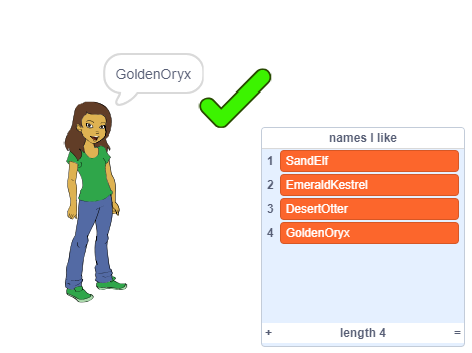

\--- geen druk \---

Dit is die **Scratch 3** weergawe van die projek. Daar is ook 'n [Scratch 2 weergawe van die projek](https://projects.raspberrypi.org/en/projects/username-generator-scratch2).

\--- / geen druk \---

## inleiding

Dit is belangrik om nie u regte naam of enige persoonlike inligting in u aanlyngebruikernaam te gebruik nie. In hierdie projek genereer jy leuke gebruikers name wat jy kan gebruik op webwerwe soos Scratch.

### Wat jy sal maak

\--- geen druk \---

Om die finale projek uit te probeer:

- Klik op die meisiesprit om 'n nuwe gebruikersnaam te genereer
- Klik op die ✔ om 'n gebruikersnaam by te voeg wat jy van die lys hou

  <iframe allowtransparency="true" width="485" height="402" src="https://scratch.mit.edu/projects/embed/292974184/?autostart=false" frameborder="0" scrolling="no"></iframe>
  

\--- / geen druk \---

\--- slegs druk \---

\--- / slegs druk \---

## \--- collapse \---

## title: What you will need

### Hardware

- 'N rekenaar wat Scratch kan hardloop

### sagteware

- Scratch 3 (óf [aanlyn](http://rpf.io/scratchon){: target = "_ blank"} of [offline](http://rpf.io/scratchoff){: target = "_ blank"})

### downloads

The starter project can be found [here](http://rpf.io/p/en/username-generator-go){:target="_blank"}.

\--- /collapse \---

## \--- inval \---

## title: What you will learn

- Gebruik lyste in Scratch
- Gebruik die verf instrument om beelde te skep
- Hoe om tekslêers en prente vanaf Scratch uit te voer

\--- /inval \---

## \--- collapse \---

## title: Additional information for educators

\--- no-print \---

If you need to print this project, please use the [printer-friendly version](https://projects.raspberrypi.org/en/projects/username-generator/print){:target="_blank"}.

\--- /no-print \---

You can find the [completed project here](http://rpf.io/p/en/username-generator-get){:target="_blank"}.

\--- /collapse \---