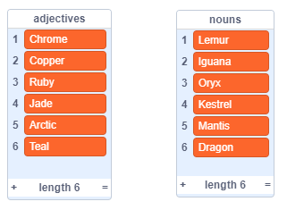
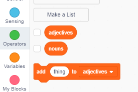

## Genereer gebruikersname

Daar is baie webwerwe en programme wat 'n gebruikersnaam gebruik om jou te identifiseer. Hierdie gebruikersnaam is dikwels vir ander sigbaar. Gebruikers name kan ook skerm name, gamer tags of handvatsels genoem word.

Dit is belangrik dat u gebruikersnaam nie u regte naam is nie en ook geen persoonlike inligting bevat nie, soos u ouderdom, geboortejaar of waar u woon. Ander mense sal jou gebruikersnaam sien, so maak seker dit is beleefd en oorweeg wat mense oor jou sal dink wanneer hulle dit lees. Onthou dat jy vir 'n lang tyd jou gebruikersnaam kan gebruik - sal jy dit nog oor drie jaar hou?

Soos u kan sien, is dit belangrik om u gebruikersnaam noukeurig te kies. Kom ons skep 'n Scratch-projek om 'AdjectiveNoun' gebruikers name soos 'DiamondIguana' te genereer.

\--- taak \---

Maak die Scratch-aanvangsprojek oop.

**Aanlyn**: maak die aanvangsprojek by [rpf.io/usernameon](http://rpf.io/usernameon){: target = "_ blank"} oop.

If you have a Scratch account you can make a copy by clicking **Remix**.

**Offline**: open the [starter project](http://rpf.io/p/en/username-generator-go){:target="_blank"} in the offline editor.

If you need to download and install the Scratch offline editor, you can find it at [rpf.io/scratchoff](http://rpf.io/scratchoff){:target="_blank"}.

You should see two lists on the stage — `adjectives` and `nouns`:



\--- /task \---

\--- task \---

Click on **Variables**, and then click the boxes next to `adjectives` and `nouns` to uncheck them and hide the lists.



\--- /task \---

\--- task \---

Add a variable called `username` which should be available **for all sprites**.

[[[generic-scratch3-add-variable]]]

\--- /task \---

\--- task \---

Click the box next to `username` to uncheck it and hide the variable from the stage.


\--- /task \---

\--- task \---

Add a person sprite — you can choose your favourite one.


You can also click on **Costumes** and choose the costume you prefer.

\--- /task \---

\--- task \---

Add this code to your person sprite:


```blocks3
wanneer hierdie sprite gekliek het
stel [gebruikersnaam v] na []
```

\--- /task \---

\--- task \---

You need to combine an adjective and a noun, so add a `join`{:class="block3operators"} block inside your `set`{:class="block3variables"} block.


```blocks3
wanneer hierdie sprite geklik het
stel [gebruikersnaam v] aan (sluit [apple] [banana] :: +) in
```

\--- /task \---

\--- task \---

Add an adjective in the first box in the `join`{:class="block3operators"} block.


```blocks3
wanneer hierdie sprite gekliek het
stel [gebruikersnaam v] na (voeg (item (1) van [byvoeglike naamwoorde v] :: +) [banana])
```

\--- /task \---

\--- task \---

Pick a `random`{:class="block3operators"} adjective between 1 and the `length of the adjectives list`{:class="block3variables"}


```blocks3
wanneer hierdie sprite gekliek het
stel [gebruikersnaam v] aan (sluit aan (item (kies ewekansige (1) na (lengte van [byvoeglike naamwoorde v] :: +) :: +) van [byvoeglike naamwoorde v]) [banana])
```

\--- /task \---

\--- task \---

Add a random noun in the second box.


```blocks3
wanneer hierdie sprite geklik het
stel [gebruikersnaam v] aan (sluit aan (item (kies ewekansige (1) tot (lengte van [byvoeglike naamwoorde v])) van [byvoeglike naamwoorde v]) (item (kies ewekansig (1) na (lengte van [ selfstandige naamwoorde v] :: +) :: +) van [nouns v] :: +))
```

\--- /task \---

\--- task \---

Now add code blocks to get your person to say the username.


```blocks3
wanneer hierdie sprite geklik het
stel [gebruikersnaam v] aan (sluit aan (item (kies ewekansige (1) tot (lengte van [byvoeglike naamwoorde v])) van [byvoeglike naamwoorde v]) (item (kies ewekansig (1) na (lengte van [ selfstandige naamwoorde v])) van [selfstandige naamwoorde v]))
+ sê (gebruikersnaam :: veranderlikes)
```

\--- /task \---

\--- task \---

Test your code by clicking on the person sprite. You should get a new random username each time.


\--- /task \---