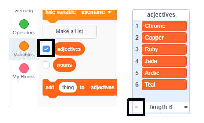

## Uitdaging: voeg meer verskeidenheid by

Can you add more items to the lists of adjectives and nouns?

Check the boxes for the lists to show them on the stage. Then click the **+** icon and type a new word into the list. Don't forget to start each word with a capital letter.

Real and imaginary animals and creatures work well in the `nouns` list. Try to think of unusual ones.

Here are some ideas for the `adjectives` list:

+ Metale: sink, koper, yster, messing, silwer, goud
+ Kleure: Crimson, Aqua, Magenta, Golden, Indigo
+ Edelstene: Kwarts, Smaragd, Sapphire, Diamant
+ Habitats: Maan, Woestyn, Sneeu, Jungle, Bos, Ruimte

Remember to hide the lists from the stage when testing your project.