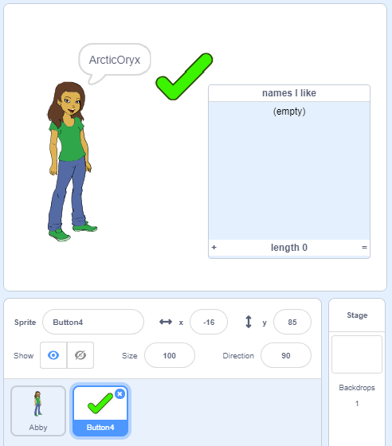

## Stoor jou gunsteling gebruikersname

Jy sal waarskynlik 'n paar verskillende gebruikers name wil oorweeg. Kom ons voeg gebruikers name by wat jy graag na 'n lys wil.

\--- taak \---

Skep 'n nuwe lys genaamd `name. Ek hou van`:

[[[generic-scratch3-make-list]]]

\--- / taak \---

\--- taak \---

Die lys sal op die verhoog verskyn. Sleep dit regs van jou persoon se sprite en maak dit wyer.


\--- / taak \---

\--- taak \---

Voeg die `Button4` sprite, wat lyk soos <span style="color: green;">✔</span>, en sleep dit oor die verhoog regs van die spraakborrel.



Jy mag dalk die `name skuif wat ek` lys wil hê as die `Button4` sprite daaronder is.

\--- / taak \---

\--- taak \---

Voeg kode by die knoppie sprite sodat wanneer dit geklik word, die huidige gebruikersnaam by `name gevoeg word. Ek hou van`.


```blocks3
wanneer hierdie sprite geklik het
voeg (gebruikersnaam :: veranderlikes) by [name ek hou van v]
```

\--- / taak \---

\--- taak \---

Toets jou kode deur op die persoon se sprite te klik totdat jy 'n gebruikersnaam vind wat jy wil en dan op die <span style="color: green;">✔</span>klik.


\--- / taak \---

\--- taak \---

U kan u lys gebruikers name na 'n tekslêer uitvoer om dit te stoor. Regskliek op die `name Ek hou van` lys op die verhoog, klik **Uitvoer**, en kies 'n plek om die lys as 'n lêer te stoor.


U het nou 'n tekslêer met 'n lys name wat u kan oopmaak met Notepad of 'n ander teksredakteur.

\--- / taak \---