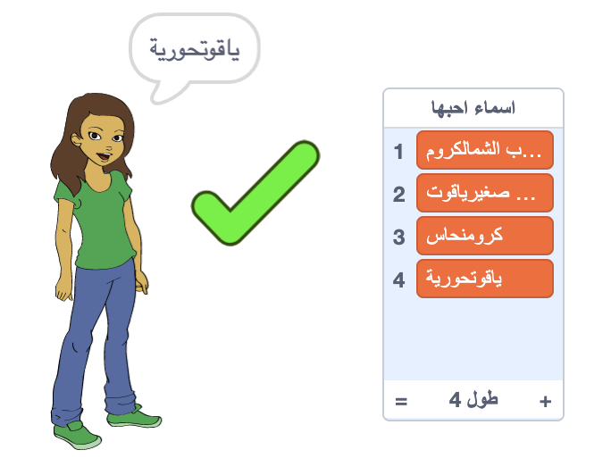

\--- no-print \---

هذا هو إصدار ** Scratch 3 ** من المشروع. هناك أيضًا [ إصدار Scratch 2 للمشروع ](https://projects.raspberrypi.org/en/projects/username-generator-scratch2).

\--- /no-print \---

## المقدمة

من المهم عدم استخدام اسمك الحقيقي أو أي معلومات شخصية في اسم المستخدم الخاص بك على الإنترنت. في هذا المشروع سوف تقوم بإنشاء أسماء مستخدمين ممتعة يمكنك استخدامها على مواقع مثل سكراتش (Scratch).

### ما الذي ستصنعه

\--- no-print \---

لتجربة المشروع المكتمل:

- انقر فوق كائن الفتاة لإنشاء اسم مستخدم جديد
- انقر فوق ✔ لإضافة اسم مستخدم اعجبك للقائمة

  <iframe allowtransparency="true" width="485" height="402" src="https://scratch.mit.edu/projects/embed/292974184/?autostart=false" frameborder="0" scrolling="no"></iframe>
  

\--- /no-print \---

\--- print-only \---

\--- /print-only \---

## \--- collapse \---

## title: ما الذي ستحتاجه

### الأجهزة

- جهاز كمبيوتر يدعم تشغيل برنامج Scratch

### البرامج

- Scratch 3 (either [online](https://rpf.io/scratchon){:target="_blank"} or [offline](https://rpf.io/scratchoff){:target="_blank"})

### للتحميل

The starter project can be found [here](https://rpf.io/p/en/username-generator-go){:target="_blank"}.

\--- /collapse \---

## \--- collapse \---

## title: ما الذي ستتعلمه

- استخدام القوائم في Scratch
- استخدام أداة الرسم لإنشاء صور
- كيفية تصدير ملفات نصية وصور من Scratch

\--- /collapse \---

## \--- collapse \---

## title: معلومات إضافية للمعلمين

\--- no-print \---

إذا كنت بحاجة إلى طباعة هذا المشروع ، فالرجاء استخدام الإصدار [الملائم للطابعة](https://projects.raspberrypi.org/en/projects/username-generator/print){:target="_blank"}.

\--- /no-print \---

You can find the [completed project here](https://rpf.io/p/en/username-generator-get){:target="_blank"}.

\--- /collapse \---