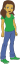

## توليد أسماء المستخدمين

هناك العديد من المواقع والتطبيقات التي تستخدم اسم المستخدم للتعرف عليك. اسم المستخدم هذا غالبا ما يكون مرئيا للآخرين. يمكن أن تسمى أسماء المستخدمين أيضًا أسماء الشاشة، أو علامات اللاعب، أو التحكم.

من المهم أن يكون اسم المستخدم الخاص بك ليس اسمك الحقيقي كما أنه لا يتضمن أي معلومات شخصية. مثل عمرك أو سنة ميلادك أو مكان سكنك. سيرى أناس آخرون اسم المستخدم الخاص بك، لذا تأكد من أنه مهذب، والاخذ بالاعتبار في ما سيفكره الناس عنك عندما يقرأونه. تذكر أنك قد تستخدم اسم المستخدم الخاص بك لفترة طويلة - هل ستظل تحبه بعد ثلاث سنوات؟

كما ترون، من المهم اختيار اسم المستخدم الخاص بكم بعناية. دعونا ننشئ مشروع Scratch لتوليد أسماء مستخدمين يتكون من "صفات واسماء" مثل 'ياقوتإجوانا'.

\--- task \---

افتح مشروع جديد من برنامج سكراتش.

**Online**: open the starter project at [rpf.io/usernameon](https://rpf.io/usernameon){:target="_blank"}.

اذا كنت تملك حساب على منصة السكراتش (Scratch) فيمكنك عمل نسخة بالضغط على **Remix**.

**Offline**: open the [starter project](https://rpf.io/p/en/username-generator-go){:target="_blank"} in the offline editor.

If you need to download and install the Scratch offline editor, you can find it at [rpf.io/scratchoff](https://rpf.io/scratchoff){:target="_blank"}.

يجب أن تشاهد قائمتين على المسرح - ` صفات ` و `اسماء`:


\--- /task \---

\--- task \---

انقر فوق **المتغيرات**، ثم انقر فوق المربع بجوار `صفات ` و `اسماء` لإلغاء تحديدها وإخفاء القوائم.


\--- /task \---

\--- task \---

قم بإضافة متغير يسمى `اسم المستخدم` والذي ينبغي أن يكون متاحاً **لجميع الكائنات **.

[[[generic-scratch3-add-variable]]]

\--- /task \---

\--- task \---

انقر فوق المربع بجوار `اسم المستخدم` لإلغائه وإخفاء المتغير من المنصة.


\--- /task \---

\--- task \---

أضف كائن شخص - يمكنك اختيار الكائن المفضل لديك.


يمكنك أيضًا النقر على **المظاهر** واختيار المظهر الذي تفضله.

\--- /task \---

\--- task \---

أضف هذه التعليمات البرمجية إلى كائن الشخص:



```blocks3
when this sprite clicked
set [username v] to []
```

\--- /task \---

\--- task \---

تحتاج إلى الجمع بين صفة و اسم ، لذلك أضف كتلة `اربط `{:class="block3operators"} داخل كتلة `اجعل `{:class="block3variables"}.


```blocks3
when this sprite clicked
set [username v] to (join [apple] [banana] :: +)
```

\--- /task \---

\--- task \---

قم بإضافة صفة في المربع الأول في كتلة `اربط `{:class="block3operators"}.


```blocks3
when this sprite clicked
set [username v] to (join (item (1) of [adjectives v] :: +) [banana])
```

\--- /task \---

\--- task \---

اختر صفة `عشوائي`{:class="block3operators"} بين 1 و `طول قائمة الصفات`{:class="block3variables"}


```blocks3
when this sprite clicked
set [username v] to (join (item (pick random (1) to (length of [adjectives v] :: +) :: +) of [adjectives v]) [banana])
```

\--- /task \---

\--- task \---

قم بإضافة اسم عشوائي في الصندوق الثاني.


```blocks3
when this sprite clicked
set [username v] to (join (item (pick random (1) to (length of [adjectives v])) of [adjectives v]) (item (pick random (1) to (length of [nouns v] :: +) :: +) of [nouns v] :: +))
```

\--- /task \---

\--- task \---

الآن أضف كتل التعليمات البرمجية لجعل شخصك يقول اسم المستخدم.


```blocks3
when this sprite clicked
set [username v] to (join (item (pick random (1) to (length of [adjectives v])) of [adjectives v]) (item (pick random (1) to (length of [nouns v])) of [nouns v]))
+ say (username :: variables)
```

\--- /task \---

\--- task \---

اختبر التعليمات البرمجية الخاصة بك بالنقر على كائن الشخص. يجب أن تحصل على اسم مستخدم عشوائي جديد في كل مرة.


\--- /task \---