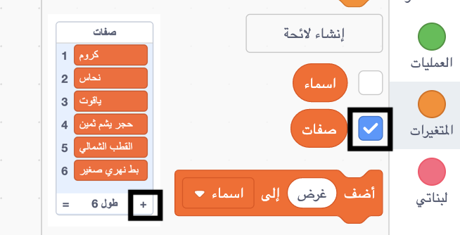

## تحدي: إضافة مزيد من التنوع

هل يمكنك إضافة المزيد من العناصر إلى قوائم الصفات والأسماء؟

حدد المربعات الخاصة بالقوائم لعرضها على المسرح. ثم انقر فوق رمز **+** واكتب كلمة جديدة في القائمة. اذا كنت تستخدم اللغة الانكليزية، لا تنسى أن تبدأ كل كلمة بحرف كبير.

تشتغل الحيوانات والمخلوقات الحقيقية والخالية بشكل جيد في قائمة `الاسماء`. حاول التفكير باسماء غير عادية.

فيما يلي بعض الأفكار لقائمة `الصفات `:

+ المعادن: زنك، النحاس، الحديد ، براس، الفضة، الذهب
+ الألوان: قرمزي ، السمائي ، أرجواني ، ذهبي ، نيلي
+ الأحجار الكريمة: الكوارتز، الزمرد، الياقوت، الماس
+ البيئة: القمر، الصحراء، الثلج، الغابة، الفضاء

تذكر أن تخفي القوائم من المسرح عند اختبار مشروعك.