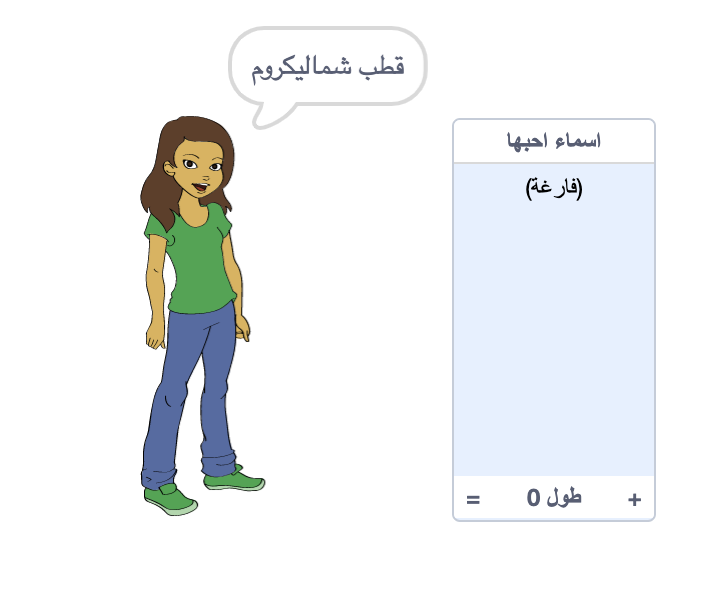
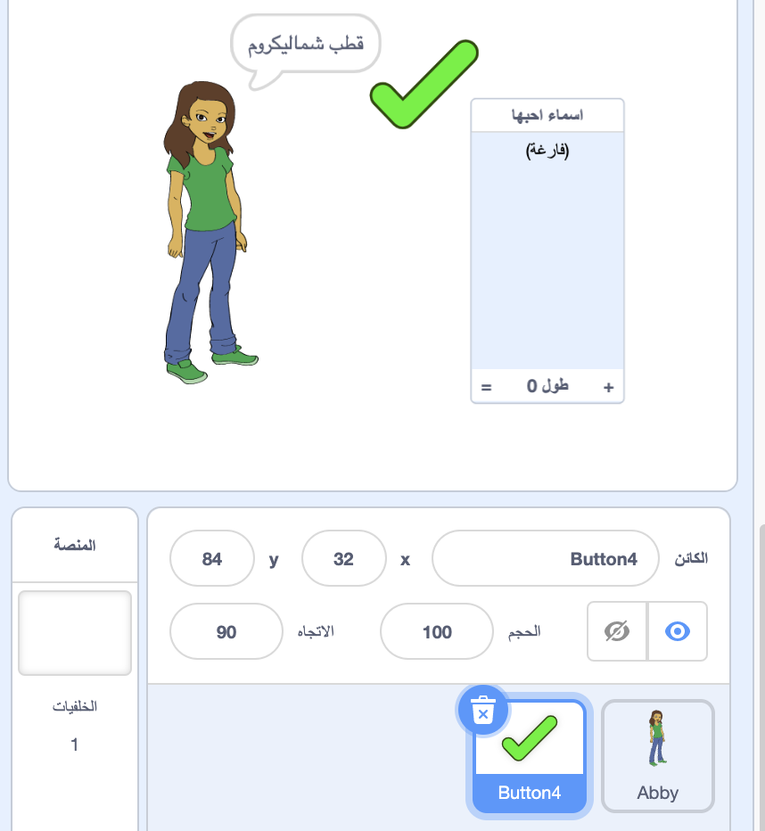
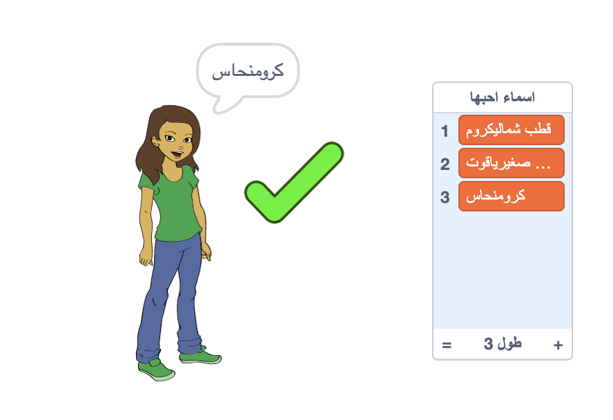
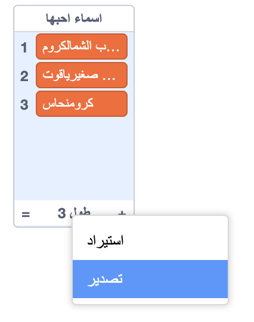

## حفظ أسماء المستخدمين المفضلة لديك

ربما تريد التفكير في بعض أسماء المستخدمين المختلفة. دعونا نضيف أسماء المستخدمين التي تحبها إلى قائمة.

--- task ---

قم بإنشاء قائمة جديدة تسمى `اسماء احبها `:

[[[generic-scratch3-make-list]]]

--- /task ---

--- task ---

ستظهر القائمة على المسرح. قم بسحبها إلى يمين الكائن الخاص بك واجعل عرضها أوسع.



--- /task ---

--- task ---

أضف كائن الزر `Button4`، والذي يبدو بالشكل <span style="color: green;">✔</span> ، واسحبه عبر الجزء الرئيسي إلى يمين فقاعة الكلام.



قد تحتاج إلى نقل قائمة `اسماء احبها` إذا كان الكائن `Button4` تحتها.

--- /task ---

--- task ---

أضف تعليمة برمجية إلى كائن الزر بحيث عندما يتم النقر عليه، يتم إضافة اسم المستخدم الحالي إلى قائمة `اسماء احبها `.


```blocks3
when this sprite clicked
add (اسم المستخدم :: variables) to [أسماء أحبها v]
```

--- /task ---

--- task ---

اختبر التعليمات البرمجية الخاصة بك بالنقر على كائن الشخص حتى تجد اسم مستخدم تحبه ثم اضغط على <span style="color: green;">✔</span>.



--- /task ---

--- task ---

يمكنك تصدير قائمة أسماء المستخدمين الخاصة بك إلى ملف نصي لحفظها. انقر بالزر الأيمن على قائمة `اسماء احبها` ثم انقر فوق **تصدير**، واختيار مكان لحفظ القائمة كملف.



لديك الآن ملف نصي يحتوي على قائمة أسماء يمكنك فتحها مع برنامج Notepad أو اي محرر نصوص آخر.

--- /task ---