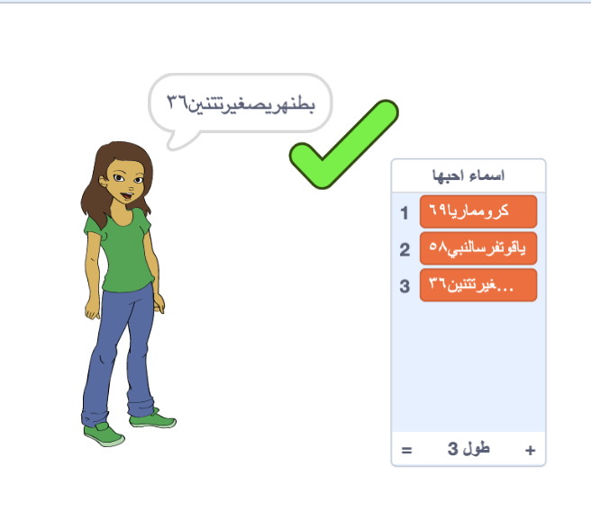

## تحدي: إضافة رقم

في مواقع الويب والتطبيقات الشائعة، قد يكون من الصعب العثور على اسم مستخدم لا يستخدمه شخص آخر بالفعل. أو قد تجد أن اسم المستخدم الذي تستخدمه على موقع واحد قد تم استعماله بالفعل في مواقع أخرى. للتخلص من ذلك، يمكنك إضافة رقم إلى نهاية اسم المستخدم الخاص بك. **تذكر لا تستخدم عمرك أو تاريخ ميلادك أو سنة ميلادك.**

هل يمكنك استخدام الكتل التالية لإنشاء أسماء مستخدمين مع رقم عشوائي في النهاية؟

```blocks3
set [اسم المستخدم v] to [0]

join [hello] [world]

اسم المستخدم :: variables

pick random (20) to (99)
```

أسماء المستخدمين الجديدة التي أنشأتها يجب أن تحتوي الآن على أرقام في نهايتها:

