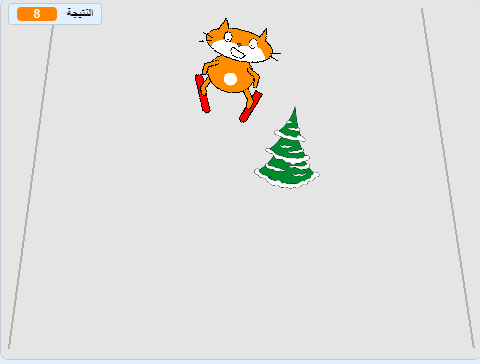

## ما التالي؟

ألق نظرة على مشروع [قطة تذهب للتزلج](https://projects.raspberrypi.org/en/projects/scratch-cat-goes-skiing) في برنامج Scratch.

--- no-print ---

أنقر على العلم الأخضر للبدء. استخدم مفتاحي السهم الأيمن والأيسر للتحكم في المتزلج.

  <iframe allowtransparency="true" width="485" height="402" src="//scratch.mit.edu/projects/embed/281116583/?autostart=false" frameborder="0" scrolling="no"></iframe>
  

--- /no-print ---

--- print-only ---

--- /print-only ---
