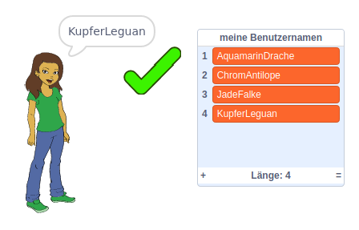

\--- no-print \---

Dies ist die **Scratch 3** Version des Projekts. Es gibt auch eine [Scratch 2 Version des Projekts](https://projects.raspberrypi.org/en/projects/username-generator-scratch2).

\--- /no-print \---

## Einleitung

Es ist wichtig, dass Du nicht Deinen richtigen Namen oder persönliche Informationen in Deinem Online-Benutzernamen verwendest. In diesem Projekt generierst Du unterhaltsame Benutzernamen, die Du auf Webseiten wie Scratch verwenden kannst.

### Was Du machen wirst

\--- no-print \---

So probierst Du das fertige Projekt aus:

- Klicke auf das Mädchen-Sprite, um einen neuen Benutzernamen zu generieren
- Klicke auf ✔, um der Liste einen gewünschten Benutzernamen hinzuzufügen

  <iframe allowtransparency="true" width="485" height="402" src="https://scratch.mit.edu/projects/embed/292974184/?autostart=false" frameborder="0" scrolling="no"></iframe>
  

\--- /no-print \---

\--- print-only \---

\--- /print-only \---

## \--- collapse \---

## title: Was Du brauchen wirst

### Hardware

- Ein Computer, auf dem Scratch ausgeführt werden kann

### Software

- Scratch 3 (entweder [online](http://rpf.io/scratchon){:target="_blank"} oder [offline](http://rpf.io/scratchoff){:target="_blank"})

### Downloads

Das Start-Projekt findest du [hier](http://rpf.io/p/en/username-generator-go){:target="_blank"}.

\--- /collapse \---

## \--- collapse \---

## title: Was du lernen wirst

- Verwende Listen in Scratch
- Verwende das Malwerkzeug, um Bilder zu erstellen
- So exportierst Du Textdateien und Bilder aus Scratch

\--- /collapse \---

## \--- collapse \---

## title: Zusätzliche Informationen für Pädagogen

\--- no-print \---

Wenn Du dieses Projekt ausdrucken möchtest, verwende die [druckerfreundliche Version](https://projects.raspberrypi.org/en/projects/username-generator/print){:target="_blank"}.

\--- /no-print \---

Du findest das [abgeschlossene Projekt hier](http://rpf.io/p/en/username-generator-get){:target="_blank"}.

\--- /collapse \---