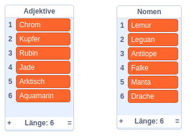
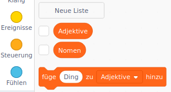
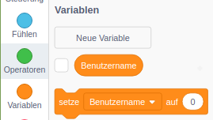
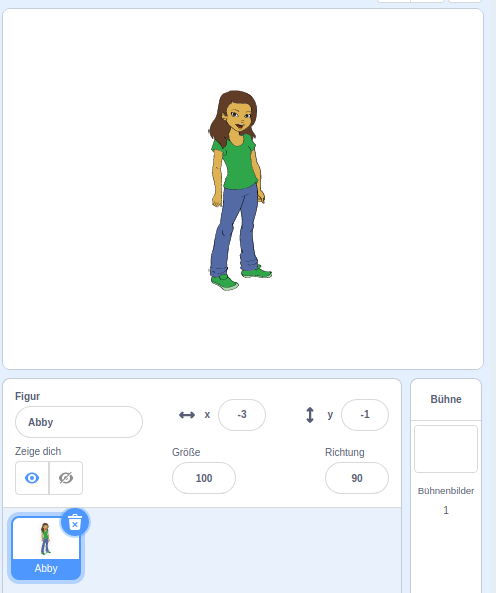
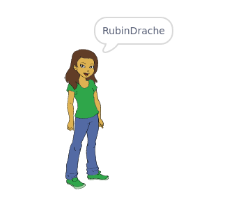

## Benutzernamen generieren

Es gibt viele Websites und Apps, die Dich mit einem Benutzernamen identifizieren. Dieser Benutzername ist oft für andere sichtbar. Benutzernamen können auch als Bildschirmnamen, Gamer-Tags oder Handles bezeichnet werden.

Es ist wichtig, dass Dein Benutzername nicht Dein richtiger Name ist und auch keine persönlichen Daten wie Alter, Geburtsjahr oder Wohnort enthält. Andere Leute werden Deinen Benutzernamen sehen, stell also sicher, dass er höflich ist und überlege, was die Leute über Dich denken, wenn sie ihn lesen. Denke daran, dass Du Deinen Benutzernamen möglicherweise für eine lange Zeit verwenden wirst - wird er Dir in drei Jahren immer noch gefallen?

Wie Du siehst, ist es wichtig, dass Du Deinen Benutzernamen sorgfältig auswählst. Erstellen wir ein Scratch-Projekt, um 'AdjektivNomen'-Benutzernamen wie 'DiamanteneEidechse' zu generieren.

\--- task \---

Öffne das Scratch Start-Projekt.

**Online**: Öffne das Start-Projekt: [rpf.io/usernameon](http://rpf.io/usernameon){:target="_blank"}.

Wenn Du bereits einen Scratch-Account besitzt, kannst Du Dir durch Klick auf **Remix** eine Kopie anlegen.

**Offline**: Öffne das [Start-Projekt](http://rpf.io/p/en/username-generator-go){:target="_blank"} im Offline-Editor.

Wenn Du Scratch herunterladen und auf Deinem Rechner installieren möchtest, dann findest Du die Datei unter diesem Link: [rpf.io/scratchoff](http://rpf.io/scratchoff){:target="_blank"}.

Du solltest zwei Listen auf der Bühne sehen – `adjectives` (Adjektive) und `nouns` (Nomen):



\--- /task \---

\--- task \---

Klicke auf **Variablen** und dann auf die Kästchen neben `Adjektive` und `Nomen`, um sie zu deaktivieren und die Listen auszublenden.



\--- /task \---

\--- task \---

Erstelle eine Variable mit dem Namen `Benutzername`, die **für alle Sprites** verfügbar sein sollte.

[[[generic-scratch3-add-variable]]]

\--- /task \---

\--- task \---

Klicke auf das Kontrollkästchen neben `Benutzername`, um es zu deaktivieren und die Variable nicht auf der Bühne anzuzeigen.



\--- /task \---

\--- task \---

Füge ein Personen-Sprite hinzu - Du kannst Dein Lieblings-Sprite auswählen.



Du kannst auch auf **Kostüme** klicken und das Kostüm auswählen, das Du bevorzugst.

\--- /task \---

\--- task \---

Füge diesen Code Deinem persönlichen Sprite hinzu:


```blocks3
when this sprite clicked
set [username v] to []
```

\--- /task \---

\--- task \---

Um ein Adjektiv und ein Nomen zu kombinieren, füge einen Block `verbinde`{: class = "block3operators"} in Deinen Block `setze`{: class = "block3variables"} ein.


```blocks3
when this sprite clicked
set [username v] to (join [apple] [banana] :: +)
```

\--- /task \---

\--- task \---

Füge im ersten Feld des Blocks `verbinde`{: class = "block3operators"} ein Adjektiv hinzu.


```blocks3
when this sprite clicked
set [username v] to (join (item (1) of [adjectives v] :: +) [banana])
```

\--- /task \---

\--- task \---

Wähle ein `zufälliges`{: class = "block3operators"} Adjektiv zwischen 1 und `Länge der Adjektivliste`{: class = "block3variables"}


```blocks3
when this sprite clicked
set [username v] to (join (item (pick random (1) to (length of [adjectives v] :: +) :: +) of [adjectives v]) [banana])
```

\--- /task \---

\--- task \---

Füge im zweiten Feld ein zufälliges Nomen hinzu.


```blocks3
when this sprite clicked
set [username v] to (join (item (pick random (1) to (length of [adjectives v])) of [adjectives v]) (item (pick random (1) to (length of [nouns v] :: +) :: +) of [nouns v] :: +))
```

\--- /task \---

\--- task \---

Füge nun Codeblöcke hinzu, damit Deine Person den Benutzernamen sagt.


```blocks3
when this sprite clicked
set [username v] to (join (item (pick random (1) to (length of [adjectives v])) of [adjectives v]) (item (pick random (1) to (length of [nouns v])) of [nouns v]))
+ say (username :: variables)
```

\--- /task \---

\--- task \---

Teste Deinen Code, indem Du auf das Personensprite klickst. Du solltest jedes Mal einen neuen zufälligen Benutzernamen erhalten.



\--- /task \---