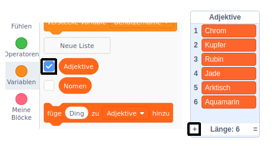

## Herausforderung: mehr Abwechslung hinzufügen

Kannst Du der Liste der Adjektive und Substantive weitere Elemente hinzufügen?

Aktiviere die Kontrollkästchen für die Listen, um sie auf der Bühne anzuzeigen. Klicke dann auf das Symbol **+** und gib ein neues Wort in die Liste ein. Vergiss nicht, jedes Wort mit einem Großbuchstaben zu beginnen.

Reale und imaginäre Tiere und Kreaturen funktionieren gut in der Liste der `Nomen`. Versuche an ungewöhnliche Tiere zu denken.

Hier sind einige Ideen für die Liste `Adjektive`:

+ Metalle: Zink, Kupfer, Eisen, Messing, Silber, Gold
+ Farben: Purpur, Aqua, Magenta, Golden, Indigo
+ Edelsteine: Quarz, Smaragd, Saphir, Diamant
+ Lebensräume: Mond, Wüste, Schnee, Dschungel, Wald, Weltraum

Denke daran, die Listen beim Testen Deines Projekts von der Bühne auszublenden.