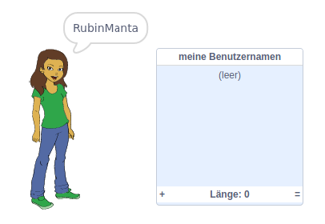
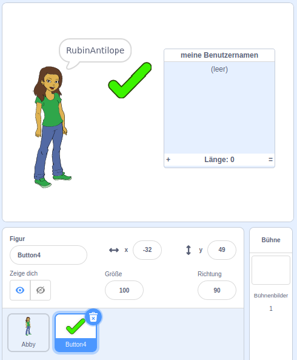
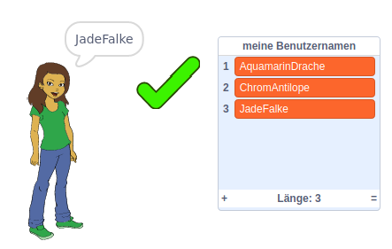
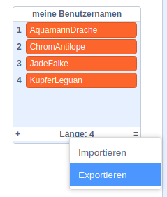

## Speichere Deine bevorzugten Benutzernamen

Du möchtest Dir wahrscheinlich verschiedene Benutzernamen überlegen. Lass uns mit den Benutzernamen, die Dir gefallen, eine Liste erstellen.

--- task ---

Erstelle eine neue Liste mit dem Namen `Meine Benutzernamen`:

[[[generic-scratch3-make-list]]]

--- /task ---

--- task ---

Die Liste erscheint auf der Bühne. Ziehe es rechts neben Dein Personen-Sprite und mache es breiter.



--- /task ---

--- task ---

Füge das Sprite `Button4`, das wie <span style="color: green;">✔</span>aussieht, ein. Ziehe es über die Bühne, bis es sich rechts von der Sprechblase befindet.



Möglicherweise musst Du die `Meine Benutzernamen` Liste verschieben, wenn der `Button4` Sprite darunter liegt.

--- /task ---

--- task ---

Füge dem Schaltflächen-Sprite Code hinzu, sodass beim Klicken der aktuelle Benutzername zu `Meine Benutzernamen` hinzugefügt wird.


```blocks3
when this sprite clicked
add (Benutzernamen :: variables) to [Meine Benutzernamen v]
```

--- /task ---

--- task ---

Teste Deinen Code, indem Du auf das Personensprite klickst, bis Du einen gewünschten Benutzernamen findest. Klicke dann auf <span style="color: green;">✔</span>.



--- /task ---

--- task ---

Du kannst Deine Liste der Benutzernamen in eine Textdatei exportieren, um sie zu speichern. Klicke mit der rechten Maustaste auf die `Meine Benutzernamen,` Liste auf der Bühne, dann auf **Exportieren** und wähle einen Ort aus, in dem die Liste als Datei gespeichert werden soll.



Du hast jetzt eine Textdatei mit einer Liste von Namen, die Du mit Notepad oder einem anderen Texteditor öffnen kannst.

--- /task ---