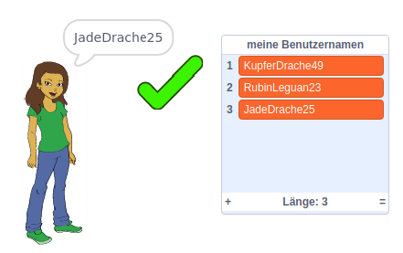

## Herausforderung: Füge eine Nummer hinzu

Auf beliebten Websites und Apps kann es sehr schwierig sein, einen Benutzernamen zu finden, den noch niemand verwendet. Oder Du stellst möglicherweise fest, dass der Benutzername, den Du auf einer Seite verwendest, bereits auf anderen Sites verwendet wird. Um dies zu umgehen, kannst Du am Ende Deines Benutzernamens eine Nummer anhängen. **Denk daran nicht Dein Alter, Geburtsdatum oder Geburtsjahr zu verwenden.**

Kannst Du die folgenden Blöcke verwenden, um Benutzernamen mit einer Zufallszahl am Ende zu generieren?

```blocks3
set [Benutzername v] to [0]

join [Hallo] [Welt]

Benutzername :: variables

pick random (20) to (99)
```

Neue Benutzernamen, die Du generierst, sollten jetzt am Ende Zahlen haben:

