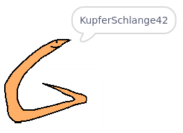

## Herausforderung: Erstelle dein Profilbild

Kannst Du das Malwerkzeug in Scratch verwenden, um ein eigenes, zu Deinem Usernamen passendes, Profilbild zu erstellen?

Hier ist ein Beispiel:

Verwende ein Bildschirmaufnahmeprogramm, um Dein Bild zu speichern, damit Du es auf Websites oder Apps verwenden kannst, auf denen Profilbilder angezeigt werden