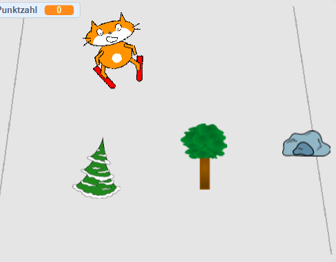

## Wie geht's weiter?

Wirf einen Blick auf das [Scratch-Katze geht Skifahren](https://projects.raspberrypi.org/de-DE/projects/scratch-cat-goes-skiing) Scratch Projekt.

--- no-print ---

Klicke zum Starten auf die grüne Flagge. Verwende die linke und rechte Pfeiltaste, um den Skifahrer zu steuern.

  <iframe allowtransparency="true" width="485" height="402" src="//scratch.mit.edu/projects/embed/405913614/?autostart=false" frameborder="0" scrolling="no"></iframe>
  

--- /no-print ---

--- print-only ---

--- /print-only ---

***
Dieses Projekt wurde von freiwilligen Helfern übersetzt:

Benedikt Kiessling

Thomas Beul

Dank freiwilliger Helfer können wir Menschen auf der ganzen Welt die Möglichkeit geben, in ihrer eigenen Sprache zu lernen. Du kannst uns helfen, mehr Menschen zu erreichen, indem Du dich freiwillig zum Übersetzen meldest - weitere Informationen unter [rpf.io/translate](https://rpf.io/translate).
