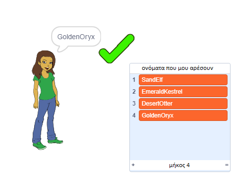

\--- no-print \---

Αυτή είναι η έκδοση **Scratch 3** του έργου. Υπάρχει επίσης η [έκδοση Scratch 2 του έργου](https://projects.raspberrypi.org/en/projects/username-generator-scratch2).

\--- /no-print \---

## Εισαγωγή

Είναι σημαντικό να μην χρησιμοποιείς το πραγματικό σου όνομα ή προσωπικά στοιχεία στο ηλεκτρονικό σου όνομα χρήστη (username). Σε αυτό το έργο θα δημιουργήσεις διασκεδαστικά ονόματα χρήστη που μπορείς να χρησιμοποιείς σε ιστότοπους όπως το Scratch.

### Τι θα φτιάξεις

\--- no-print \---

Για να δοκιμάσεις το ολοκληρωμένο έργο:

- Κάνε κλικ στο κορίτσι για να δημιουργήσεις ένα νέο όνομα χρήστη
- Κάνε κλικ στο ✔ για να προσθέσεις ένα όνομα χρήστη που σου αρέσει στη λίστα

  <iframe allowtransparency="true" width="485" height="402" src="https://scratch.mit.edu/projects/embed/292974184/?autostart=false" frameborder="0" scrolling="no"></iframe>
  

\--- /no-print \---

\--- print-only \---

\--- /print-only \---

## \--- collapse \---

## title: Τι θα χρειαστείς

### Υλικό

- Έναν υπολογιστή ικανό να τρέχει το Scratch

### Λογισμικό

- Scratch 3 (είτε [online](http://rpf.io/scratchon){:target="_blank"} είτε [offline](http://rpf.io/scratchoff){:target="_blank"})

### Λήψεις

Το αρχικό project μπορεί να βρεθεί [εδώ](http://rpf.io/p/en/username-generator-go){:target="_blank"}.

\--- /collapse \---

## \--- collapse \---

## title: Τι θα μάθεις

- Να χρησιμοποιείς τις λίστες στο Scratch
- Να χρησιμοποιείς το εργαλείο ζωγραφικής για να δημιουργείς εικόνες
- Πώς να εξάγεις αρχεία κειμένου και εικόνας από το Scratch

\--- /collapse \---

## \--- collapse \---

## title: Πρόσθετες πληροφορίες για εκπαιδευτικούς

\--- no-print \---

Αν χρειαστεί να εκτυπώσεις αυτό το έργο, χρησιμοποίησε την [εκτυπώσιμη έκδοση](https://projects.raspberrypi.org/en/projects/username-generator/print)"{:target="_blank"}.

\--- /no-print \---

Μπορείς να βρεις [το ολοκληρωμένο έργο εδώ](http://rpf.io/p/en/username-generator-get){:target="_blank"}.

\--- /collapse \---