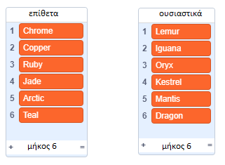
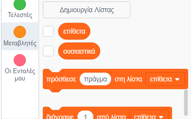
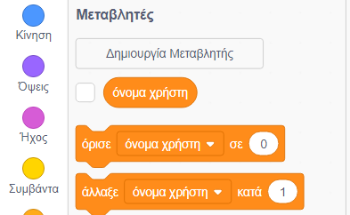
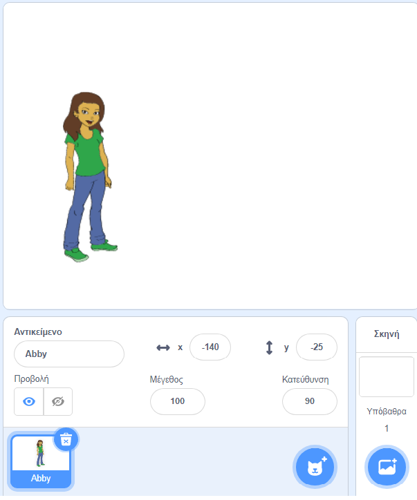

## Δημιουργία ονομάτων χρήστη

Υπάρχουν πολλές ιστοσελίδες και εφαρμογές που χρησιμοποιούν ένα όνομα χρήστη για την αναγνώρισή σου. Αυτό το όνομα χρήστη, που συχνά ονομάζουμε username, είναι συχνά ορατό σε άλλους. Τα ονόματα χρήστη μπορούν επίσης να ονομάζονται ονόματα οθόνης ή ετικέτες παίκτη και είναι πάντα γραμμένα με λατινικούς χαρακτήρες.

Είναι σημαντικό το όνομα χρήστη σου να μην είναι το πραγματικό σου όνομα και επίσης να μην περιλαμβάνει προσωπικά στοιχεία, όπως την ηλικία, το έτος γέννησης ή τον τόπο κατοικίας σου. Άλλα άτομα θα δουν το όνομα χρήστη σου, οπότε βεβαιώσου ότι είναι ευγενικό και σκέψου τι θα σκεφτούν οι άνθρωποι για σένα όταν το διαβάσουν. Θυμήσου ότι μπορείς να χρησιμοποιείς το όνομα χρήστη σου για μεγάλο χρονικό διάστημα - θα σου αρέσει ακόμα μετά από τρία χρόνια;

Όπως βλέπεις, είναι σημαντικό να επιλέξεις προσεκτικά το δικό σου όνομα χρήστη. Ας δημιουργήσουμε ένα έργο Scratch για να δημιουργήσουμε λατινικά ονόματα χρήστη της μορφής «ΕπίθετοΟυσιαστικό» όπως το «DiamondIguana», δηλαδή σα να λέμε "ΔιαμαντένιοΙγκουάνα".

\--- task \---

Άνοιξε το αρχικό έργο Scratch.

**Online:** άνοιξε το αρχικό έργο στο [rpf.io/usernameon](http://rpf.io/usernameon){:target="_blank"}.

Αν έχεις λογαριασμό Scratch μπορείς να κάνεις ένα αντίγραφο, κάνοντας κλικ στο κουμπί **Ανάμειξη**.

**Offline**: άνοιξε το [αρχικό έργο](http://rpf.io/p/en/username-generator-go){:target="_blank"} στον επεξεργαστή εκτός σύνδεσης.

Αν χρειαστεί να κατεβάσεις και να εγκαταστήσεις τον offline editor για το Scratch, μπορείς να το βρεις στο [rpf.io/scratchoff](http://rpf.io/scratchoff){:target="_blank"}.

Θα πρέπει να δεις δύο λίστες στη σκηνή - `επίθετα` και `ουσιαστικά`:



\--- /task \---

\--- task \---

Κάνε κλικ στις **Μεταβλητές** και, στη συνέχεια, κάνε κλικ στα κουτάκια δίπλα στις μεταβλητές `επίθετα` και `ουσιαστικά` για να τα (απο)επιλέξετε και να αποκρύψεις τις λίστες. 



\--- /task \---

\--- task \---

Πρόσθεσε μια μεταβλητή που ονομάζεται `όνομα χρήστη` που πρέπει να είναι διαθέσιμη **σε όλα τα αντικείμενα**.

[[[generic-scratch3-add-variable]]]

\--- /task \---

\--- task \---

Κάνε κλικ στο κουτάκι δίπλα στη μεταβλητή `όνομα χρήστη` για μην εμφανίζεται η μεταβλητή στη σκηνή.



\--- /task \---

\--- task \---

Πρόσθεσε ένα αντικείμενο, όπως το παρακάτω κορίτσι - εσύ μπορείς να επιλέξεις το αγαπημένο σου.



Μπορείς επίσης να κάνεις κλικ στις **Ενδυμασίες** και να επιλέξεις την ενδυμασία που σου αρέσει.

\--- /task \---

\--- task \---

Πρόσθεσε αυτόν τον κώδικα στο αντικείμενο σου:


```blocks3
when this sprite clicked
set [username v] to []
```

\--- /task \---

\--- task \---

Πρέπει να συνδυάσεις ένα επίθετο με ένα ουσιαστικό, οπότε πρόσθεσε μια εντολή `ένωσε`{:class="block3operators"} εντός του μπλοκ `όρισε`{:class="block3variables"}.


```blocks3
when this sprite clicked
set [username v] to (join [apple] [banana] :: +)
```

\--- /task \---

\--- task \---

Βάλε ένα επίθετο στο πρώτο πλαίσιο του μπλοκ `ένωσε`μπλοκ{:class="block3operators"}.


```blocks3
when this sprite clicked
set [username v] to (join (item (1) of [adjectives v] :: +) [banana])
```

\--- /task \---

\--- task \---

Επίλεξε ένα `τυχαίο`{:class="block3operators"} αριθμό ανάμεσα στο 1 και στο `μήκος της λίστας 'επίθετα'`{:class="block3variables"}


```blocks3
when this sprite clicked
set [username v] to (join (item (pick random (1) to (length of [adjectives v] :: +) :: +) of [adjectives v]) [banana])
```

\--- /task \---

\--- task \---

Πρόσθεσε ένα τυχαίο ουσιαστικό στο δεύτερο πλαίσιο.


```blocks3
when this sprite clicked
set [username v] to (join (item (pick random (1) to (length of [adjectives v])) of [adjectives v]) (item (pick random (1) to (length of [nouns v] :: +) :: +) of [nouns v] :: +))
```

\--- /task \---

\--- task \---

Τώρα πρόσθεσε εντολές για να κάνεις το άτομό σου να πει το όνομα χρήστη.


```blocks3
when this sprite clicked
set [username v] to (join (item (pick random (1) to (length of [adjectives v])) of [adjectives v]) (item (pick random (1) to (length of [nouns v])) of [nouns v]))
+ say (username :: variables)
```

\--- /task \---

\--- task \---

Δοκίμασε τον κώδικά σου κάνοντας κλικ στο άτομο. Θα πρέπει να δεις ένα τυχαίο όνομα χρήστη κάθε φορά.


\--- /task \---