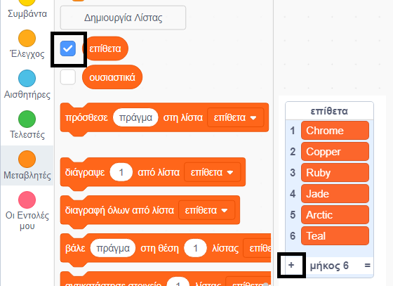

## Πρόκληση: πρόσθεσε μεγαλύτερη ποικιλία

Μπορείς να προσθέσεις περισσότερα στοιχεία στις λίστες επιθέτων και ουσιαστικών;

Επίλεξε τα κουτάκια στις λίστες για να τις εμφανίσεις στη σκηνή. Στη συνέχεια, κάντε κλικ στο εικονίδιο **+** και πληκτρολόγησε μια νέα λέξη στη λίστα. Μην ξεχάσεις να γράφεις λατινικά και να ξεκινάς κάθε λέξη με κεφαλαίο γράμμα.

Τα πραγματικά ή φανταστικά ζώα και πλάσματα λειτουργούν καλά στη λίστα `ουσιαστικά`. Προσπάθησε να σκεφτείς ασυνήθιστα.

Ακολουθούν μερικές ιδέες για τη λίστα `επίθετα`:

+ Μέταλλα: Zinc, Copper, Iron, Brass, Silver, Gold
+ Χρώματα: Crimson, Aqua, Magenta, Golden, Indigo
+ Πολύτιμοι λίθοι: Quartz, Emerald, Sapphire, Diamond
+ Οικότοποι: Moon, Desert, Snow, Jungle, Forest, Space

Θυμήσου να αποκρύψεις και πάλι τις λίστες από τη σκηνή μετά τη δοκιμή του έργου σου.