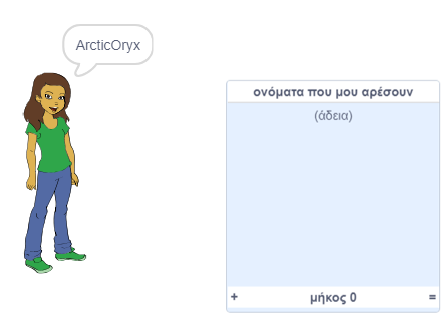
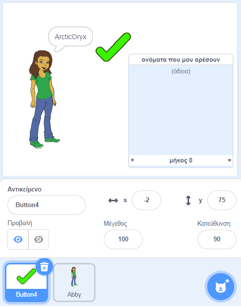
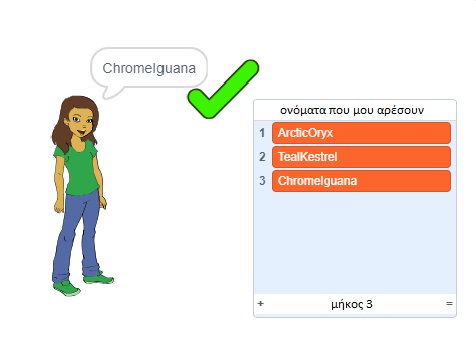
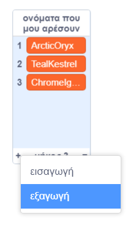

## Αποθήκευση των αγαπημένων σου ονομάτων χρήστη

Πιθανότατα θέλεις να δεις μερικά ονόματα χρήστη πριν αποφασίσεις ποιο να διαλέξεις. Ας προσθέσουμε τα ονόματα χρηστών που σου αρέσουν σε μια λίστα.

\--- task \---

Δημιούργησε μια νέα λίστα `ονόματα που μου αρέσουν`:

[[[generic-scratch3-make-list]]]

\--- /task \---

\--- task --

Η λίστα θα εμφανιστεί στη σκηνή. Σύρε τη στα δεξιά του αντικειμένου σου και κάνε την πιο πλατιά.



\--- /task \---

\--- task --

Πρόσθεσε το κουμπί `Button4`, που μοιάζει με <span style="color: green;">✔</span> και σύρε το δεξιά από το συννεφάκι ομιλίας.



Ίσως χρειαστεί να μετακινήσεις τη λίστα `ονόματα που μου αρέσουν` εάν το κουμπί `Button4` βρίσκεται από κάτω.

\--- /task \---

\--- task \---

Πρόσθεσε κώδικα στο κουμπί έτσι ώστε όταν κάνεις κλικ πάνω του, το τρέχον όνομα χρήστη να προστίθεται στη λίστα `ονόματα που μου αρέσουν`.


```blocks3
when this sprite clicked
add (username :: variables) to [names I like v]
```

\--- /task \---

\--- task --

Δοκίμασε τον κώδικά σου κάνοντας κλικ στο άτομο μέχρι να βρεις ένα όνομα χρήστη που σου αρέσει και στη συνέχεια κάνοντας κλικ στο <span style="color: green;">✔</span>.



\--- /task \---

\--- task --

Μπορείς να εξάγεις τη λίστα των ονομάτων χρήστη σε ένα αρχείο κειμένου για να τα αποθηκεύσεις. Κάνε δεξί κλικ στη λίστα `ονόματα που μου αρέσουν` πάνω στη σκηνή, κάνε κλικ στο **εξαγωγή** και επίλεξε ένα φάκελο για να αποθηκεύσεις τη λίστα ως αρχείο.



Τώρα έχεις ένα αρχείο κειμένου που περιέχει μια λίστα ονομάτων που μπορείς να ανοίξεις με το Σημειωματάριο ή κάποιο άλλο πρόγραμμα επεξεργασίας κειμένου.

\--- /task \---