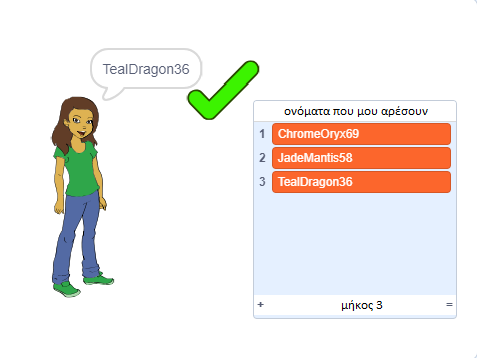

## Πρόκληση: πρόσθεσε έναν αριθμό

Σε δημοφιλείς ιστοσελίδες και εφαρμογές, μπορεί να είναι πολύ δύσκολο να βρεις ένα όνομα χρήστη που δεν χρησιμοποιεί ήδη κάποιος άλλος. Ή μπορεί να διαπιστώσεις ότι το όνομα χρήστη που χρησιμοποιείς σε μια ιστοσελίδα δεν είναι διαθέσιμο σε άλλους ιστότοπους. Για να το ξεπεράσεις αυτό, θα μπορούσες να προσθέσεις έναν αριθμό στο τέλος του ονόματος χρήστη. **Να θυμάσαι να μην χρησιμοποιείς την ηλικία, την ημερομηνία γέννησης ή το έτος γέννησής σου.**

Μπορείς να χρησιμοποιήσεις τα ακόλουθα μπλοκ για να δημιουργήσεις ονόματα χρήστη με έναν τυχαίο αριθμό στο τέλος;

```blocks3
set [username v] to [0]

join [hello] [world]

username :: variables

pick random (20) to (99)
```

Τα νέα ονόματα χρήστη που δημιουργείς θα πρέπει τώρα να έχουν αριθμούς στο τέλος:

