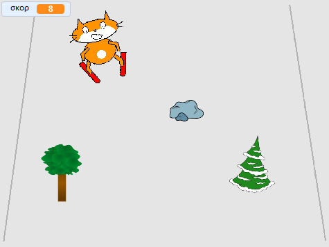

## Τι υπάρχει στη συνέχεια;

Ρίξε μια ματιά στο Scratch έργο [Η γάτα του Scratch πάει για σκι](https://projects.raspberrypi.org/en/projects/scratch-cat-goes-skiing).

--- no-print ---

Κάνε κλικ στην πράσινη σημαία για να ξεκινήσεις. Χρησιμοποίησε το αριστερό και το δεξί βελάκι για τον έλεγχο του σκιέρ.

  <iframe allowtransparency="true" width="485" height="402" src="//scratch.mit.edu/projects/embed/281116583/?autostart=false" frameborder="0" scrolling="no"></iframe>
  

--- /no-print ---

--- print-only ---

--- /print-only ---
