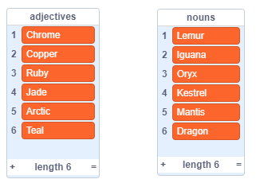
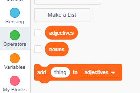

## Generating usernames

There are lots of websites and apps that use a username to identify you. This username is often visible to others. Usernames can also be called screen names, gamer tags, or handles. 

It’s important that your username isn’t your real name and doesn’t include any personal information, such as your age, year of birth, or where you live. Other people will see your username, so make sure it’s polite, and consider what people will think about you when they read it. Remember that you might be using your username for a long time — will you still like it in three years? 

As you can see, it’s important to choose your username carefully. Let's create a Scratch project to generate **AdjectiveNoun** usernames like __DiamondIguana__. 

+ Open the 'Username generator' Scratch project: your club leader will give you a copy, or you can open it online <a href="http://jumpto.cc/username-go" target="_blank">by clicking here</a>.

+ You should see two lists on the stage — `adjectives` and `nouns`:

	

+ Click on **Data**, and then uncheck the boxes next to `adjectives` and `nouns` to hide them.

	
	
+ Add a variable called `username`.

	
	
+ Uncheck the box next to the `username` variable to hide it from the stage.

	

+ Add a person sprite — you can choose your favourite one. 

	
	
	You can also click on **Costumes** and choose the costume you prefer.

+ Add this code to your person sprite:

	
	
+ You need to combine an adjective and a noun. Add a `join`{:class="blockoperators"} block inside your `set` block:

	
	
+ Add a random adjective in the first box in the join.

	
	
+ Add a random noun in the second box.

	
	
+ Now add the code to get your person to say the username.

	

+ Test your code by clicking on the person. You should get a new random username each time. 

	

