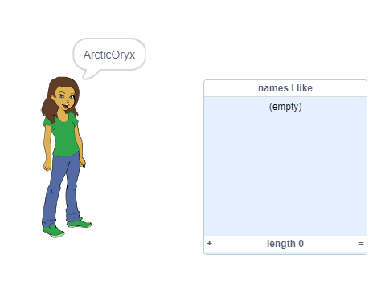
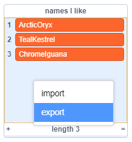

## Saving Your Favourite Usernames

You probably want to consider a few different usernames. Let’s add usernames that you like to a list. 

+ Create a new list called 'names I like':

	

+ The list will appear on the stage. Drag it to the right of your person and make it wider:

	

+ Add the tick sprite and drag the tick sprite on the stage to the right of the speech bubble:

	

+ Add code to the tick sprite to add the current username to 'names I like' when the tick is clicked: 

	

+ Test your code by clicking on the person until you find a username you like and then clicking on the tick:

	

+ You can export your list of possible usernames to a text file. Right-click on the `names I like` list on the Stage and choose 'Export' ad choose a place to save (check with your volunteer if you're not sure where to save.) 

	
	
	You now have a text file containing a list of names which you can open with Notepad or another text editor. 

