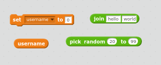
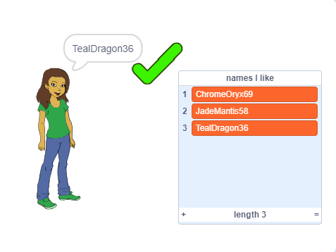

--- challenge ---
## Challenge: Add a number

On some popular websites and apps it can be really hard to find a username that someone else hasn’t already used. You might find that the username you use on other sites is already taken. You could add a number to the end of the username. Remember not to use your age or your date or year of birth. 

Can you use these blocks to generate usernames with a random number on the end. 

Your new usernames should have numbers on the end:

--- /challenge ---