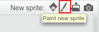
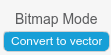

--- challenge ---
## Challenge: create your profile picture

Can you use the paint tool in Scratch to create your own profile picture to go with a username?

If you want to try drawing using shapes that you can move around, then switch to **vector mode** by clicking **Convert to vector** at bottom right-hand side:

Here's an example:

Save your picture so that you can use it on websites or apps which show profile pictures.

+ Right-click on a costume to save it as a file on your computer.

Images created in **bitmap mode** will be saved as `.png` files. Images created in vector mode will be saved as `.svg` files.

`.png` files are more widely used — if you've been drawing in vector mode and want to save your picture as a `.png` file, switch to bitmap mode before saving. Clicking **undo** will get you back to vector mode.

--- /challenge ---
