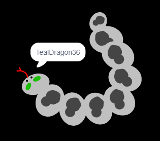

--- challenge ---
## Challenge: create your profile picture

Can you use the paint tool in Scratch to create your own profile picture to go with a username?

If you want to try drawing using shapes that you can move around, then switch to **vector mode** by clicking the icon on the bottom right-hand side:

Here's an example:

You can also save your picture so you can use it on websites or apps which use a profile picture.

+ Right-click on a costume to save it as a file on your computer.

Images created in **bitmap mode** will be saved as `.png` files. Images created in **vector mode** will be saved as `.svg` files.

`.png` files are more widely used, and you can switch to bitmap mode before saving to get a `.png` file (**undo** will get you back to vector mode.)

--- /challenge ---
