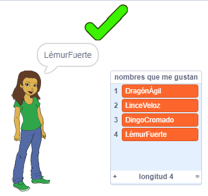

\--- no-print \---

Esta es una versión en **Scratch 3** del proyecto. También hay una [versión del proyecto en Scratch 2](https://projects.raspberrypi.org/en/projects/username-generator-scratch2).

\--- /no-print \---

## Introducción

Es importante que no utilices tu nombre real o cualquier otra información personal en tu nombre de usuario en línea. En este proyecto crearemos nombres de usuario divertidos que puedes usar en sitios web como Scratch.

### Lo que harás

\--- no-print \---

Para probar el proyecto terminado:

- Haz clic en el objeto chica para generar un nuevo nombre de usuario
- Haz clic en ✔ para añadir un nombre de usuario que te guste a la lista

  <iframe allowtransparency="true" width="485" height="402" src="https://scratch.mit.edu/projects/embed/292974184/?autostart=false" frameborder="0" scrolling="no"></iframe>
  

\--- /no-print \---

\--- print-only \---

\--- /print-only \---

## \--- collapse \---

## title: Lo que necesitarás

### Hardware

- Ordenador capaz de ejecutar Scratch

### Software

- Scratch 3 (ya sea [online](http://rpf.io/scratchon){:target="_blank"} u [offline](http://rpf.io/scratchoff) {:target="_blank"})

### Descargas

El proyecto de iniciación puede encontrarse [aquí](http://rpf.io/p/en/username-generator-go){:target="_blank"}.

\--- /collapse \---

## \--- collapse \---

## title: Lo que aprenderás

- Usar listas en Scratch
- Usar la herramienta de pintura para crear imágenes
- Cómo exportar archivos de texto e imágenes desde Scratch

\--- /collapse \---

## \--- collapse \---

## title: Información adicional para educadores

\--- no-print \---

Si necesitas imprimir este proyecto, usa la [versión para imprimir](https://projects.raspberrypi.org/en/projects/username-generator/print){:target="_blank"}.

\--- /no-print \---

Puedes [encontrar el proyecto completo aquí](http://rpf.io/p/en/username-generator-get){:target ="_blank"}.

\--- /collapse \---