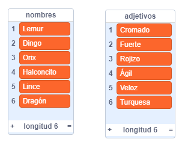
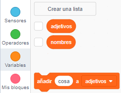
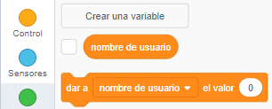
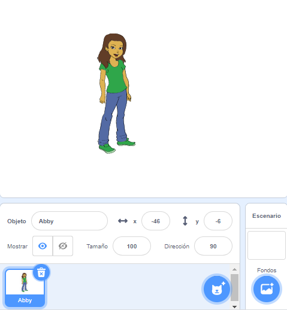
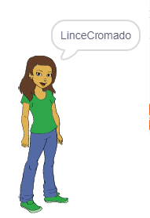

## Generando nombres de usuario

Hay muchos sitios web y aplicaciones que utilizan un nombre de usuario para identificarte. Este nombre de usuario es a menudo visible para otros. Los nombres de usuario también se pueden llamar nombres de pantalla, etiquetas de jugador o identificadores.

Es importante que tu nombre de usuario no sea tu nombre real y que no incluya información personal, como tu edad, año de nacimiento o el lugar en el que vives. Otras personas verán tu nombre de usuario, así que asegúrate de que es adecuado y considera lo que la gente pensará sobre ti cuando lo lean. Recuerda que puedes estar usando tu nombre de usuario durante mucho tiempo. ¿Aún te gustará dentro de tres años?

Como puedes ver, es importante elegir cuidadosamente un nombre de usuario. Vamos a crear un proyecto de Scratch para generar nombres de usuario del tipo 'NombreAdjetivo' como 'IguanaBrillante'.

\--- task \---

Abre el proyecto inicial de Scratch.

**En línea**: abre el proyecto de inicio en [rpf.io/usernameon](http://rpf.io/usernameon){:target="_blank"}.

Si tienes una cuenta de Scratch puedes hacer una copia haciendo clic en **Reinventar**.

**Sin conexión**: abre el [proyecto de inicio](http://rpf.io/p/en/username-generator-go){:target="_blank"} en el editor sin conexión.

Si necesita descargar e instalar el editor sin conexión de Scratch, puede encontrarlo en [rpf.io/scratchoff](http://rpf.io/scratchoff){: target = "_ blank"}.

Deberías ver dos listas en el escenario - ` nombres ` y ` adjetivos `:



\--- /task \---

\--- task \---

Haz clic en **Variables**, y luego haga clic en las casillas junto a `adjetivos` y `nombres` para desmarcarlas y ocultar las listas.



\--- /task \---

\--- task \---

Crea una variable llamada `nombre de usuario` que debería estar disponible **para todos los objetos**.

[[[generic-scratch3-add-variable]]]

\--- /task \---

\--- task \---

Haz clic en la casilla junto a ` nombre de usuario ` para desmarcarlo y ocultar la variable del escenario.



\--- /task \---

\--- task \---

Elige un objeto persona: puedes escoger tu favorito.



También puede hacer clic en **Disfraces** y elige el disfraz que prefieras.

\--- /task \---

\--- task \---

Añade este código a tu objeto persona:


```blocks3
when this sprite clicked
set [username v] to []
```

\--- /task \---

\--- task \---

Necesitas combinar un nombre y un adjetivo, así que añade un bloque `unir`{:class="block3operators"} dentro de tu bloque `dar a`{:class="block3variables"}.


```blocks3
when this sprite clicked
set [username v] to (join [apple] [banana] :: +)
```

\--- /task \---

\--- task \---

Añade un nombre en la primera caja del bloque `unir`{:class="block3operators"}.


```blocks3
when this sprite clicked
set [username v] to (join (item (1) of [adjectives v] :: +) [banana])
```

\--- /task \---

\--- task \---

Elige un nombre `aleatorio`{:class="block3operators"} entre 1 y la `longitud de la lista de adjetivos`{:class="block3variables"}


```blocks3
when this sprite clicked
set [username v] to (join (item (pick random (1) to (length of [adjectives v] :: +) :: +) of [adjectives v]) [banana])
```

\--- /task \---

\--- task \---

Agrega un adjetivo al azar en el segundo cuadro.


```blocks3
when this sprite clicked
set [username v] to (join (item (pick random (1) to (length of [adjectives v])) of [adjectives v]) (item (pick random (1) to (length of [nouns v] :: +) :: +) of [nouns v] :: +))
```

\--- /task \---

\--- task \---

Ahora añade bloques de código para que tu personaje diga el nombre de usuario.


```blocks3
when this sprite clicked
set [username v] to (join (item (pick random (1) to (length of [adjectives v])) of [adjectives v]) (item (pick random (1) to (length of [nouns v])) of [nouns v]))
+ say (username :: variables)
```

\--- /task \---

\--- task \---

Prueba tu código haciendo clic en el objeto persona. Deberías obtener un nuevo nombre de usuario de forma aleatoria cada vez.



\--- /task \---