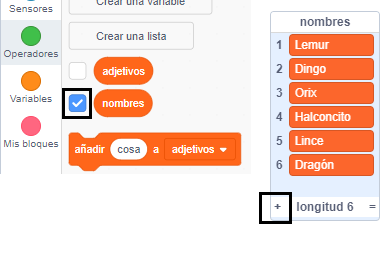

## Desafío: añadir más variedad

¿Puedes añadir más elementos a las listas de nombres y adjetivos?

Marca las casillas de las listas para mostrarlas en el escenario. Luego haz clic en ** + ** y escribe una nueva palabra en la lista. No olvides comenzar cada palabra con una letra mayúscula.

Animales y criaturas reales e imaginarias funcionan bien en la lista de los `nombres`. Intenta pensar en los más inusuales.

Aquí tienes algunas ideas para la lista de `adjetivos`:

+ Metálicos: DeZinc, DeCobre, DeHierro, DeLatón, DePlata, DeOro
+ Colores: Carmesí, Aguamarina, Magenta, Dorado, Añil
+ Piedras preciosas: DeCuarzo, DeEsmeralda, DeZafiro, DeDiamante
+ Hábitats: Lunar, Desértico, Nevado, Selvático, Forestal, Espacial

Recuerda ocultar las listas del escenario cuando pruebes tu proyecto.