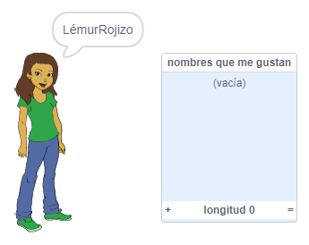
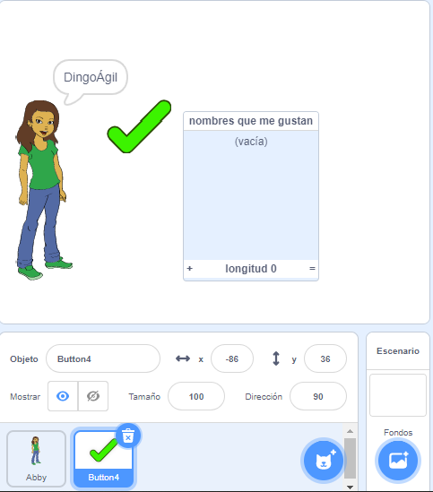
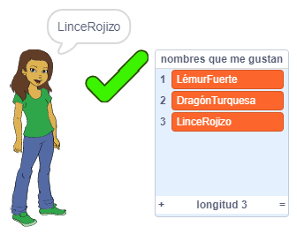
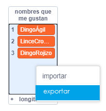

## Guardando tus nombres de usuario favoritos

Probablemente querrás probar algunos nombres de usuario diferentes. Añadamos los nombres de usuario que te gusten a una lista.

\--- task \---

Crea una nueva lista llamada `nombres que me gustan`:

[[[generic-scratch3-make-list]]]

\--- /task \---

\--- task \---

La lista aparecerá en el escenario. Arrástralo a la derecha de tu objeto persona y hazlo más ancho.



\--- /task \---

\--- task \---

Añade el objeto `Buttton4`, que se parece a <span style="color: green;">✔</span>, y arrástralo a la derecha de la burbuja de discurso.



Es posible que debas mover la lista `nombres que me gustan ` si el objeto `Button4` está debajo de él.

\--- /task \---

\--- task \---

Añade código al objeto del botón para que cuando se haga clic en él, el nombre de usuario actual se agregue a `nombres que me gustan`.


```blocks3
when this sprite clicked
add (username :: variables) to [names I like v]
```

\--- /task \---

\--- task \---

Prueba tu código haciendo clic en el objeto persona hasta que encuentres un nombre de usuario que te guste y luego haz clic en <span style="color: green;">✔</span>.



\--- /task \---

\--- task \---

Puedes exportar su lista de nombres de usuario a un archivo de texto para guardarlos. Haz clic derecho en la lista en el escenario `nombres que me gustan`, luego clic en <stong>Exportar</strong> y elije un lugar para guardar la lista como un archivo.



Ahora tienes un archivo de texto que contiene una lista de nombres que puede abrir con el Bloc de notas u otro editor de texto.

\--- /task \---