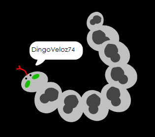

## Desafío: crea tu foto de perfil

¿Puedes usar la herramienta de pintura en Scratch para crear tu propia imagen de perfil con un nombre de usuario?

Aquí tienes un ejemplo:

Utiliza un programa de captura de pantalla para guardar la imagen, para que la puedas utilizar en sitios web o aplicaciones que muestren imágenes de perfil