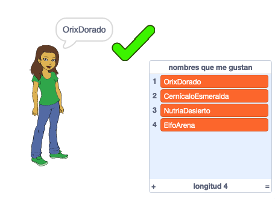

--- no-print ---

Esta es la versión **Scratch 3** del proyecto. También hay una [versión del proyecto en Scratch 2](https://projects.raspberrypi.org/es-LA/projects/username-generator-scratch2).

--- /no-print ---

## Introducción

Es importante no usar tu nombre real o cualquier información personal en tu nombre de usuario en línea. En este proyecto generarás nombres de usuario divertidos que puedes usar en sitios como Scratch.

### Lo que harás

--- no-print ---

Para probar el proyecto terminado:

- Haz clic en el objeto de niña para generar un nuevo nombre de usuario
- Haz clic en ✔ para añadir un nombre de usuario que te guste a la lista

  <iframe allowtransparency="true" width="485" height="402" src="https://scratch.mit.edu/projects/embed/408401035/?autostart=false" frameborder="0" scrolling="no"></iframe>
  

--- /no-print ---

--- print-only ---

--- /print-only ---

--- collapse ---
---
title: Lo que necesitarás
---

### Hardware

- Una computadora capaz de ejecutar Scratch

### Programa

- Scratch 3 (ya sea [con Internet](http://rpf.io/scratchon){:target="_blank"} o [sin Internet](http://rpf.io/scratchoff){:target="_blank"})

### Descargas

El proyecto de iniciación puede encontrarse [aquí](http://rpf.io/p/es-LA/username-generator-go){:target="_blank"}.

--- /collapse ---

--- collapse ---
---
title: Lo que aprenderás
---

- Usar listas en Scratch
- Usa la herramienta de pintura para crear imágenes
- Cómo exportar archivos de texto e imágenes desde Scratch

--- /collapse ---

--- collapse ---
---
title: Información adicional para educadores
---

--- no-print ---

Si necesitas imprimir este proyecto, por favor utiliza la [versión para imprimir](https://projects.raspberrypi.org/es-LA/projects/username-generator/print){:target="_blank"}.

--- /no-print ---

Puedes encontrar el [proyecto completo aquí](http://rpf.io/p/es-LA/username-generator-get){:target="_blank"}.

--- /collapse ---