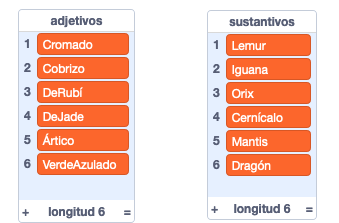
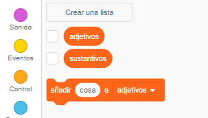
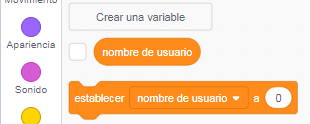
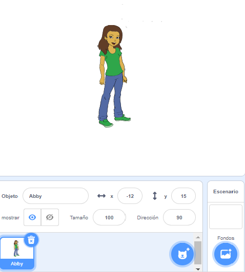
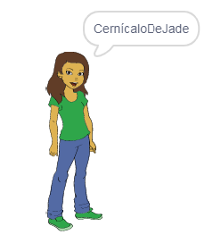

## Generando nombres de usuario

Hay muchos sitios web y aplicaciones que utilizan un nombre de usuario para identificarte. Este nombre de usuario es frecuentemente visible para otros. Los nombres de usuario también pueden llamarse nombres de pantalla, etiquetas de jugadores o identificadores.

Es importante que tu nombre de usuario no sea tu nombre real y tampoco incluya ninguna información personal como tu edad, tu año de nacimiento o donde vives. Otras personas verán tu nombre de usuario, así que asegúrate de que sea cortés y ten en cuenta lo que las personas pensarán de ti cuando lo lean. Recuerda que podrías estar usando tu nombre de usuario durante mucho tiempo. ¿Aún te gustará dentro de tres años?

Como puedes ver, es importante elegir tu nombre de usuario cuidadosamente. Vamos a crear un proyecto de Scratch para generar nombres de usuario 'SustantivoAdjetivo' como 'IguanaDeDiamante'.

\--- task \---

Abre el proyecto inicial de Scratch.

**En línea**: abre el proyecto de inicio en [rpf.io/usernameon](http://rpf.io/usernameon){:target="_blank"}.

Si tienes una cuenta de Scratch, puedes hacer una copia haciendo clic en ** Remix **.

**Sin conexión**: abre el [proyecto de iniciación](http://rpf.io/p/en/username-generator-go){:target=_blank"} en el editor sin conexión.

Si necesitas descargar e instalar el editor offline de Scratch, puedes encontrarlo en [rpf.io/scratchoff](http://rpf.io/scratchoff){:target="_blank"}.

Deberías ver dos listas en el escenario — `adjetivos` y `sustantivos`:



\--- /task \---

\--- task \---

Haz clic en **Variables**, y luego haz clic en las casillas junto a `adjetivos` y `sustantivos` para desmarcarlas y ocultar las listas.



\--- /task \---

\--- task \---

Añade una variable llamada `nombre de usuario` que debería estar disponible **para todos los objetos**.

[[[generic-scratch3-add-variable]]]

\--- /task \---

\--- task \---

Haz clic en la casilla junto a ` nombre de usuario ` para desmarcarlo y ocultar la variable del escenario.



\--- /task \---

\--- task \---

Agrega un objeto de una persona — puedes elegir tu favorito.



También puedes hacer clic en ** Disfraces ** y elige el disfraz que prefieras.

\--- /task \---

\--- task \---

Agrega este código a tu objeto persona:


```blocks3
when this sprite clicked
set [username v] to []
```

\--- /task \---

\--- task \---

You need to combine an adjective and a noun, so add a `join`{:class="block3operators"} block inside your `set`{:class="block3variables"} block.


```blocks3
when this sprite clicked
set [username v] to (join [apple] [banana] :: +)
```

\--- /task \---

\--- task \---

Add an adjective in the first box in the `join`{:class="block3operators"} block.


```blocks3
when this sprite clicked
set [username v] to (join (item (1) of [adjectives v] :: +) [banana])
```

\--- /task \---

\--- task \---

Pick a `random`{:class="block3operators"} adjective between 1 and the `length of the adjectives list`{:class="block3variables"}


```blocks3
when this sprite clicked
set [username v] to (join (item (pick random (1) to (length of [adjectives v] :: +) :: +) of [adjectives v]) [banana])
```

\--- /task \---

\--- task \---

Add a random noun in the second box.


```blocks3
when this sprite clicked
set [username v] to (join (item (pick random (1) to (length of [adjectives v])) of [adjectives v]) (item (pick random (1) to (length of [nouns v] :: +) :: +) of [nouns v] :: +))
```

\--- /task \---

\--- task \---

Now add code blocks to get your person to say the username.


```blocks3
when this sprite clicked
set [username v] to (join (item (pick random (1) to (length of [adjectives v])) of [adjectives v]) (item (pick random (1) to (length of [nouns v])) of [nouns v]))
+ say (username :: variables)
```

\--- /task \---

\--- task \---

Test your code by clicking on the person sprite. You should get a new random username each time.



\--- /task \---