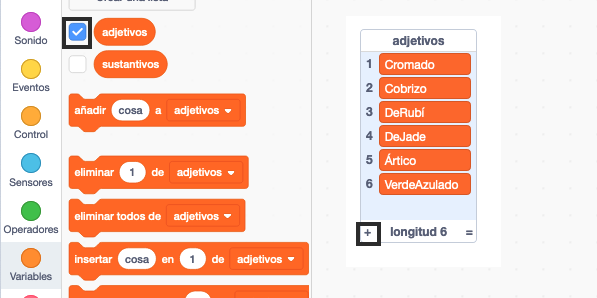

## Desafío: agrega más variedad

¿Puedes agregar más elementos a las listas de adjetivos y sustantivos?

Marca las casillas de las listas para mostrarlas en el escenario. Luego haz clic en el icono **+** y escribe una nueva palabra en la lista. No te olvides de empezar cada palabra con una letra mayúscula.

Los animales y criaturas reales e imaginarios funcionan bien en la lista `sustantivos`. Trata de pensar en los inusuales.

Aquí hay algunas ideas para la lista `adjetivos`:

+ Metales: Zinc, Cobre, Hierro, Plata, Oro
+ Colores: Carmesí, Aguamarina, Magenta, Dorado, Índigo
+ Piedras preciosas: Cuarzo, Esmeralda, Zafiro, Diamante
+ Hábitats: Luna, Desierto, Nieve, Jungla, Bosque, Espacio

Recuerda ocultar las listas del Escenario cuando pruebes tu proyecto.