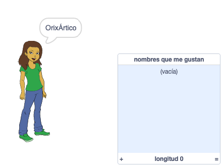
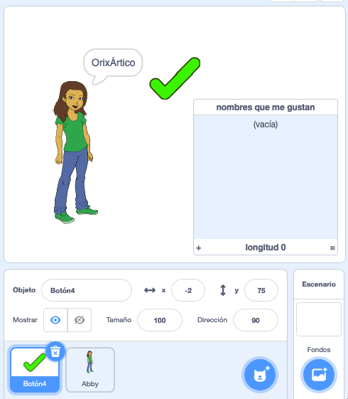
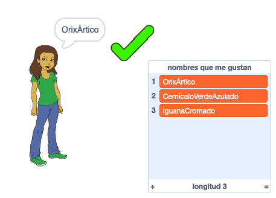
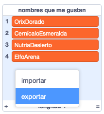

## Guardando tus nombres de usuario favoritos

Probablemente quieras considerar algunos nombres de usuario diferentes. Agreguemos los nombres de usuario que te gusten a una lista.

--- task ---

Crear una nueva lista llamada `nombres que me gustan`:

[[[generic-scratch3-make-list]]]

--- /task ---

--- task ---

La lista aparecerá en el escenario. Arrástrala a la derecha del objeto de tu persona y hazla más amplio.



--- /task ---

--- task ---

Añade el objeto `Botón4`, que parece <span style="color: green;">✔</span>, y arrástralo a la derecha de la burbuja de voz.



Puede que tengas que mover los `nombres que me gustan` si el objeto `Botón` está debajo de él.

--- /task ---

--- task ---

Agrega código al objeto de botón para que cuando se haga clic en él, el nombre de usuario actual se agregue a `nombres que me gustan`.


```blocks3
when this sprite clicked
add (nombre de usuario :: variables) to [nombres que me gustan v]
```

--- /task ---

--- task ---

Prueba tu código haciendo clic en el objeto de la persona hasta que encuentres un nombre de usuario que te guste y luego haz clic en <span style="color: green;">✔</span>.



--- /task ---

--- task ---

Puedes exportar tu lista de nombres de usuario a un archivo de texto para guardarlos. Haz clic derecho en los `nombres que me gustan` en el escenario, haz clic en **Exportar**, y elije un lugar para guardar la lista como un archivo.



Ahora tienes un archivo de texto que contiene una lista de nombres que puedes abrir con Bloc de notas u otro editor de texto.

--- /task ---