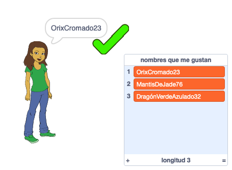

## Desafío: agrega un número

En sitios web y aplicaciones populares, puede ser realmente difícil encontrar un nombre de usuario que otra persona no esté usando ya. O puedes encontrar que el nombre de usuario que usas en un sitio ya está tomado en otros sitios. Para evitarlo, puedes añadir un número al final de tu nombre de usuario. **Recuerda no usar tu edad, fecha de nacimiento o año de nacimiento.**

¿Puedes usar los siguientes bloques para generar nombres de usuario con un número aleatorio al final?

```blocks3
set [username v] to [0]

join [hello] [world]

username :: variables

pick random (20) to (99)
```

Los nuevos nombres de usuario que generes ahora deberían tener números al final:

