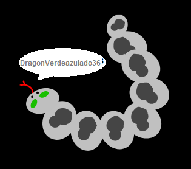

## Desafío: crea tu foto de perfil

¿Puedes usar la herramienta de pintura en Scratch para crear tu propia foto de perfil para ir con un nombre de usuario?

Aquí tienes un ejemplo:

Usa un programa de captura de pantalla para guardar la imagen para que la puedas usar en sitios web o aplicaciones que muestren imágenes de perfil