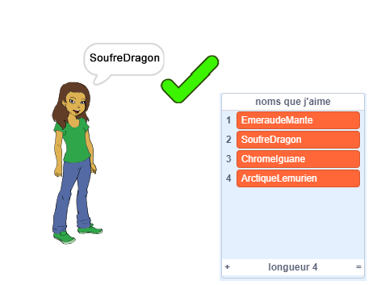

\--- no-print \---

Ceci est la version **Scratch 3** du projet. Il existe également une version [Scratch 2 du projet](https://projects.raspberrypi.org/en/projects/username-generator-scratch2).

\--- /no-print \---

## Introduction

Il est important de ne pas utiliser ton vrai nom ou tes renseignements personnels comme nom d'utilisateur en ligne. Dans ce projet, tu vas générer des noms d'utilisateurs amusants que tu pourras utiliser sur des sites Web comme Scratch.

### Ce que tu feras

\--- no-print \---

Pour essayer le projet terminé :

- Clique sur le sprite de fille pour générer un nouveau nom d'utilisateur
- Clique sur le ✔ pour ajouter à la liste un nom d'utilisateur que tu aimes

  <iframe allowtransparency="true" width="485" height="402" src="https://scratch.mit.edu/projects/embed/292974184/?autostart=false" frameborder="0" scrolling="no"></iframe>
  

\--- /no-print \---

\--- print-only \---

\--- /print-only \---

## \--- collapse \---

## title: Ce dont tu auras besoin

### Matériel informatique

- Un ordinateur capable d'exécuter Scratch

### Logiciels

- Scratch 3 ( [en ligne](http://rpf.io/scratchon) ou [hors ligne](http://rpf.io/scratchoff)")

### Téléchargements

Le projet de démarrage peut être trouvé [ici](http://rpf.io/p/fr-FR/username-generator-go){:target="_blank"}.

\--- /collapse \---

## \--- collapse \---

## title: Ce que tu vas apprendre

- Utiliser les listes dans Scratch
- Utiliser l'outil de peinture pour créer des images
- Comment exporter des fichiers texte et des images depuis Scratch

\--- /collapse \---

## \--- collapse \---

## title: Informations supplémentaires pour les éducateurs

\--- no-print \---

Si vous besoin d'imprimer ce projet, utilisez la [ version imprimable. ](https://projects.raspberrypi.org/en/projects/username-generator/print) {:target="_blank"}.

\--- /no-print \---

Vous pouvez trouver le [projet terminé ici](https://rpf.io/p/en/username-generator-get){:target="_blank"}.

\--- /collapse \---