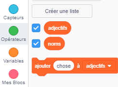
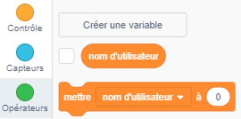
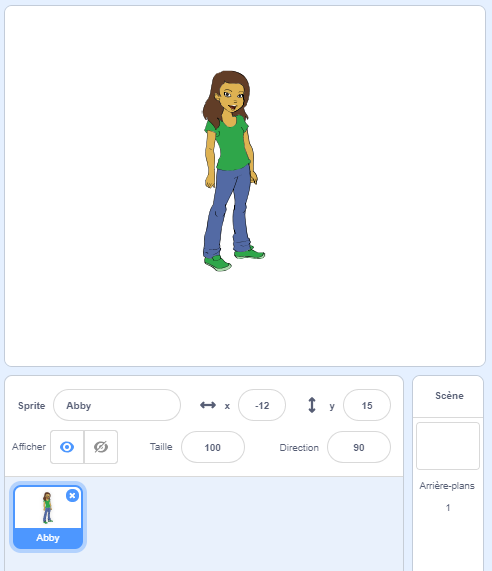
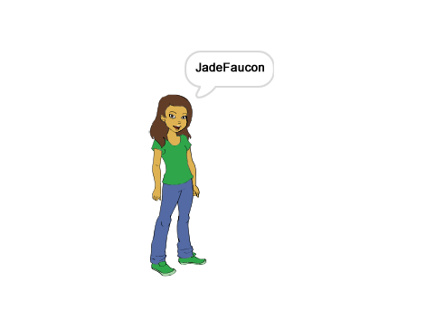

## Générer des noms d'utilisateur

Il y a beaucoup de sites web et d'applications qui utilisent un nom d'utilisateur pour t'identifier. Ce nom d'utilisateur est souvent visible par les autres. Les noms d'utilisateur peuvent également être appelés noms d'écran, tags de joueurs ou gestionnaires.

Il est important que ton nom d'utilisateur ne soit pas ton vrai nom et n'inclut pas d'informations personnelles, comme ton âge, ton année de naissance ou ton lieu de résidence. D'autres personnes verront ton nom d'utilisateur, alors assure-toi qu'il soit poli, et réfléchis à ce que les gens penseront de toi en le lisant. N'oublie pas que tu peux utiliser ton nom d'utilisateur pendant une longue période — l'aimeras-tu encore dans trois ans ?

Comme tu peux le voir, il est important de choisir son nom d’utilisateur avec soin. Créons un projet Scratch pour générer des noms d'utilisateur 'NomAdjectif' comme 'IguaneDiamant'.

\--- task \---

Ouvre le projet de démarrage Scratch.

**En ligne**: ouvre le projet de démarrage à [rpf.io/usernameon](http://rpf.io/usernameon){:target="_blank"}.

Si tu as un compte Scratch, tu peux en créer une copie en cliquant sur **Remix**.

**Hors ligne**: ouvre le [projet de démarrage](http://rpf.io/p/en/username-generator-go){:target="_blank"} dans l'éditeur hors ligne.

Si tu dois télécharger et installer l'éditeur hors ligne Scratch, tu peux le trouver à [rpf.io/scratchoff](http://rpf.io/scratchoff){:target="_blank"}.

Tu devrais voir deux listes sur la scène — `adjectifs` et `noms`:


\--- /task \---

\--- task \---

Clique sur **Variables**, puis clique sur les cases à côté des `adjectifs` et `noms` pour les décocher et masquer les listes.



\--- /task \---

\--- task \---

Ajoute une variable appelée `nom d'utilisateur` qui devrait être disponible **pour tous les sprites**.

[[[generic-scratch3-add-variable]]]

\--- /task \---

\--- task \---

Clique sur la case à côté de `nom d'utilisateur` pour le décocher et masquer la variable de la scène.



\--- /task \---

\--- task \---

Ajoute un sprite de personne — tu peux choisir ton sprite préféré.



Tu peux également cliquer sur **Costumes** et choisir le costume que tu préféres.

\--- /task \---

\--- task \---

Ajoute ce code à ton sprite de personne:


```blocks3
when this sprite clicked
set [username v] to []
```

\--- /task \---

\--- task \---

Tu dois combiner un adjectif et un nom, alors ajoute un bloc `join`{:class="block3operators"} à l'intérieur de ton `set`{:class="block3variables"}.


```blocks3
when this sprite clicked
set [username v] to (join [apple] [banana] :: +)
```

\--- /task \---

\--- task \---

Ajoute un adjectif dans la première case du bloc `joindre`{:class="block3operators"}.


```blocks3
when this sprite clicked
set [username v] to (join (item (1) of [adjectives v] :: +) [banana])
```

\--- /task \---

\--- task \---

Choisis un adjectif `aléatoire`{:class="block3operators"} entre 1 et la `longueur de la liste d'adjectifs`{:class="block3variables"}


```blocks3
when this sprite clicked
set [username v] to (join (item (pick random (1) to (length of [adjectives v] :: +) :: +) of [adjectives v]) [banana])
```

\--- /task \---

\--- task \---

Ajoute un nom aléatoire dans la seconde boîte.


```blocks3
when this sprite clicked
set [username v] to (join (item (pick random (1) to (length of [adjectives v])) of [adjectives v]) (item (pick random (1) to (length of [nouns v] :: +) :: +) of [nouns v] :: +))
```

\--- /task \---

\--- task \---

Maintenant, ajoute des blocs de code pour que ton lutin dise son nom d'utilisateur.


```blocks3
when this sprite clicked
set [username v] to (join (item (pick random (1) to (length of [adjectives v])) of [adjectives v]) (item (pick random (1) to (length of [nouns v])) of [nouns v]))
+ say (username :: variables)
```

\--- /task \---

\--- task \---

Teste ton code en cliquant sur le lutin de la personne. Tu devrais obtenir un nouveau nom d'utilisateur aléatoire à chaque fois.



\--- /task \---