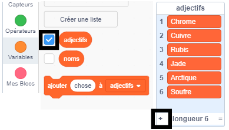

## Défi : ajouter plus de variété

Peux-tu ajouter plus d'éléments aux listes d'adjectifs et de noms ?

Coche les cases des listes pour les afficher sur la scène. Puis clique sur l’icône **+** et tape un nouveau mot dans la liste. N'oublie pas de commencer chaque mot par une lettre majuscule.

Les animaux et les créatures réels et imaginaires fonctionnent bien dans la liste `noms`. Essaie de penser à des insolites.

Voici quelques idées pour la liste `adjectifs` :

+ Métaux : Zinc, Cuivre, Fer, Laiton, Argent, Or
+ Couleurs : Pourpre, Bleu marine, Magenta, Doré, Indigo
+ Pierres précieuses : Quartz, Émeraude, Saphir, Diamant
+ Habitats : Lune, Désert, Neige, Jungle, Forêt, Espace

N'oublie pas de cacher les listes de la scène lors du test de ton projet.