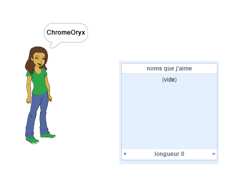
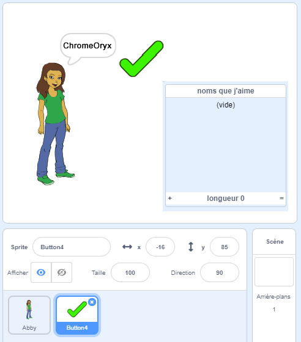
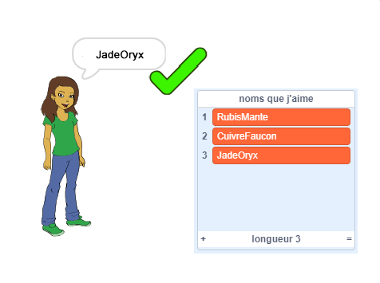
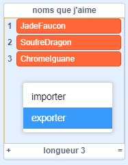

## Enregistrer tes noms d'utilisateur favoris

Tu veux probablement utiliser quelques noms d'utilisateur différents. Ajoute des noms d'utilisateur que tu aimes dans une liste.

\--- task \---

Crée une nouvelle liste appelée `noms que j'aime`:

[[[generic-scratch3-make-list]]]

\--- /task \---

\--- task \---

La liste apparaîtra sur la scène. Glisse-la à la droite de ton sprite de personne et élargis-le.



\--- /task \---

\--- task \---

Ajoute le sprite `Bouton4` qui ressemble à <span style="color: green;">✔</span>, et fais-le glisser sur la scène à droite de la bulle de parole.



Tu auras peut-être besoin de déplacer la liste `noms que j'aime` si le sprite `Bouton4` est en dessous.

\--- /task \---

\--- task \---

Ajoute du code au sprite de bouton pour que, lorsqu'il est cliqué, le nom d'utilisateur actuel soit ajouté aux `noms que j'aime`.


```blocks3
when this sprite clicked
add (username :: variables) to [names I like v]
```

\--- /task \---

\--- task \---

Teste ton code en cliquant sur le sprite de la personne jusqu'à ce que tu trouves un nom d'utilisateur que tu aimes, puis en cliquant sur le <span style="color: green;">✔</span>.



\--- /task \---

\--- task \---

Tu peux exporter ta liste de noms d'utilisateurs vers un fichier texte pour les sauvegarder. Fais un clic droit sur les `noms qui me plaisent` sur la scène, clique sur **Exporter**, et choisis un endroit où enregistrer la liste en tant que fichier.



Tu as maintenant un fichier de type texte contenant une liste de noms que tu peux ouvrir avec Notepad ou un autre éditeur de texte.

\--- /task \---