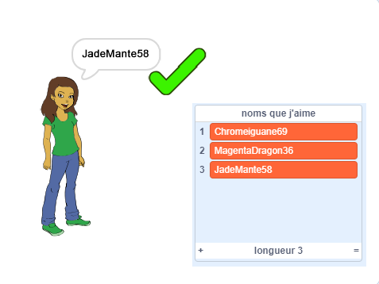

## Défi: ajoute un nombre

Sur les sites Web et les applications populaires, il peut être vraiment difficile de trouver un nom d'utilisateur que quelqu'un d'autre n'utilise pas déjà. Ou tu peux trouver que le nom d'utilisateur que tu utilises sur un site est déjà pris sur d'autres sites. Pour contourner cela, tu peux ajouter un nombre à la fin de ton nom d'utilisateur. **N'oublie pas de ne pas utiliser ton âge, ta date de naissance ou ton année de naissance.**

Peux-tu utiliser les blocs suivants pour générer des noms d'utilisateur avec un nombre aléatoire à la fin ?

```blocks3
set [nom d'utilisateur v] to [0]

join [hello] [world]

nom d'utilisateur :: variables

pick random (20) to (99)
```

Les nouveaux noms d'utilisateur que tu généres devraient maintenant avoir des chiffres à la fin :

