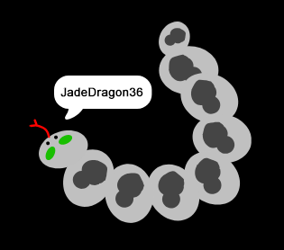

## Défi: crée ta photo de profil

Peux-tu utiliser l'outil de peinture dans Scratch pour créer ta propre photo de profil pour aller avec un nom d'utilisateur ?

Voici un exemple :

Utilise un programme de capture d'écran pour enregistrer ton image afin que tu puisses l'utiliser sur les sites Web ou les applications qui affichent les photos de profil