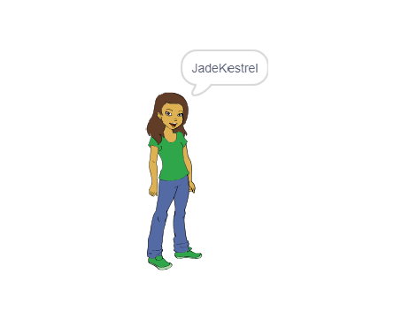

## यूजरनेम बनाना

बहुत सारी वेबसाइट और ऐप हैं जो आपको पहचानने के लिए एक यूजरनेम का उपयोग करते हैं। यह यूजर नेम अक्सर दुसरो को दिखाई देता है I यूजरनेम को स्क्रीन नेम्स , गमर टैग्स और हैंडल्स भी कहा जाता है I

यह जरुरी है के आपका यूजरनेम आपका असली नाम ना हो और जरुरी है के उसमे आपने कोई भी निजी जानकारी नहीं हो जैसे के आपकी उम्र, आपके जनम का साल या आपकी जनम की तारीक I बाकि लोग आपका यूजर नेम देख सकते है, इसलिए ध्यान रखें के वह सभ्य हो, और ध्यान में रखें के लोग आपको आपका यूजर नेम देख कर कैसा समझेंगे I ध्यान रखें - के आप एक यूजरनेम शायद काफी समय तक उपयोग करेंगे - तो क्या आपके चुना हुआ यूजरनेम ततीन साल बाद पसंद आएगा ?

जैसा कि आप देख सकते हैं, अपने यूजरनेम को सावधानी से चुनना जरुरी है। आइए 'DiamondIguana' जैसे 'AdjectiveNoun' यूजरनेम बनाने के लिए एक Scratch प्रोजेक्ट बनाएं।

\--- task \---

Scratch स्टार्टर प्रोजेक्ट खोलें।

**ऑनलाइन**: स्टार्टर प्रोजेक्ट को [rpf.io/usernameon](http://rpf.io/usernameon){: target = "_ blank"} पर खोलें।

यदि आपके पास एक Scratch खाता है, तो आप ** Remix ** पर क्लिक करके कौपी बना सकते हैं।

**ऑफ़लाइन**: ऑफ़लाइन संपादक में [स्टार्टर प्रोजेक्ट](http://rpf.io/p/en/username-generator-go){: target = "_ blank"} खोलें।

यदि आपको Scratch ऑफ़लाइन संपादक को डाउनलोड और इंस्टॉल करने की जरुरत है, तो आप इसे [rpf.io/scratchoff](http://rpf.io/scratchoff){: target = "_ blank"} पर ढूंढ सकते हैं।

आपको मंच पर दो सूचियाँ दिखनी चाहिए - ` adjectives ` और ` nouns ` :


\--- /task \---

\--- task \---

** Variables ** पर क्लिक करें, और फिर ` adjectives ` और ` संज्ञा ` के बगल में स्थित बक्सों पर क्लिक करें, उन्हें अनचेक करने और सूचियों को छिपा दें I


\--- /task \---

\--- task \---

एक वेरिएबल जोड़ें : ` username ` जो उपलब्ध होना चाहिए ** for all sprites ** ।

[[[generic-scratch3-add-variable]]]

\--- /task \---

\--- task \---

` username ` के बगल वाले बॉक्स पर क्लिक करें और इसे अनचेक करें और मंच से वेरिएबल को छिपाएं।


\--- /task \---

\--- task \---

पर्सन स्प्राइट जोड़ें - आप अपना पसंदीदा चुन सकते हैं।


आप ** Costumes ** पर भी क्लिक कर सकते हैं और वह पोशाक चुनें जिसे आप पसंद करते हैं।

\--- /task \---

\--- task \---

इस कोड को अपने व्यक्ति स्प्राइट में जोड़ें:


```blocks3
when this sprite clicked
set [username v] to []
```

\--- /task \---

\--- task \---

आपको एक विशेषण (adjective) और एक संज्ञा (noun) को मिलाना है , इसलिए एक ` join ` {<class = "block3operators"} अपने ` सेट ` {= class = "block3variables"} ब्लॉक के अंदर ब्लॉक जोड़े I


```blocks3
when this sprite clicked
set [username v] to (join [apple] [banana] :: +)
```

\--- /task \---

\--- task \---

` join ` {"class =" block3operators "} ब्लॉक होने वाले पहले बॉक्स में एक विशेषण (adjective) जोड़ें ।


```blocks3
when this sprite clicked
set [username v] to (join (item (1) of [adjectives v] :: +) [banana])
```

\--- /task \---

\--- task \---

एक `random`{:class="block3operators"} विशेषण चुनें 1 और `length of the adjectives list`{:class="block3variables"} के बीच I


```blocks3
when this sprite clicked
set [username v] to (join (item (pick random (1) to (length of [adjectives v] :: +) :: +) of [adjectives v]) [banana])
```

\--- /task \---

\--- task \---

दूसरे बॉक्स में एक गैर विशिष्ट संज्ञा (noun) जोड़ें।


```blocks3
when this sprite clicked
set [username v] to (join (item (pick random (1) to (length of [adjectives v])) of [adjectives v]) (item (pick random (1) to (length of [nouns v] :: +) :: +) of [nouns v] :: +))
```

\--- /task \---

\--- task \---

अब अपने व्यक्ति को यूजरनेम प्राप्त करने के लिए कोड ब्लॉक जोड़ें 


```blocks3
when this sprite clicked
set [username v] to (join (item (pick random (1) to (length of [adjectives v])) of [adjectives v]) (item (pick random (1) to (length of [nouns v])) of [nouns v]))
+ say (username :: variables)
```

\--- /task \---

\--- task \---

स्प्राइट पर क्लिक करके अपने कोड का परीक्षण करें। आपको हर बार एक नया गैर विशिष्ट यूजरनेम प्राप्त होना चाहिए।



\--- /task \---