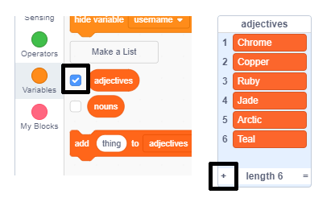

## चुनौती: अधिक शैलियों (variety) को जोड़ें

क्या आप विशेषण और संज्ञा की सूची में अधिक आइटम जोड़ सकते हैं?

उन्हें मंच पर दिखाने के लिए सूचियों के बक्से की जाँच करें। इसके बाद **+** आइकन पर क्लिक करें और सूची में एक नया शब्द टाइप करें। प्रत्येक शब्द को बड़े अक्षर से शुरू करना न भूलें।

वास्तविक और काल्पनिक जानवर और जीव `nouns` की सूची में अच्छी तरह से काम करते हैं । असामान्य के बारे में सोचने की कोशिश करें।

यहां `adjectives` सूची के लिए कुछ विचार दिए गए हैं:

+ धातु: जस्ता, तांबा, लोहा, पीतल, चांदी, सोना
+ रंग: क्रिमसन, एक्वा, मैजेंटा, गोल्डन, इंडिगो
+ रत्न: क्वार्ट्ज, पन्ना, नीलम, हीरा
+ पर्यावास: चंद्रमा, रेगिस्तान, बर्फ, जंगल, जंगल, अंतरिक्ष

अपने प्रोजेक्ट का परीक्षण करते समय सूचियों को मंच से छुपाना याद रखें।