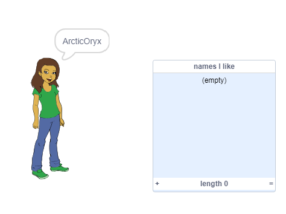
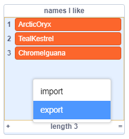

## अपने पसंदीदा यूजरनेम सहेजना

आप शायद कुछ अलग-अलग यूजरनेम पर विचार करना चाहें आइए उन यूजरनेम को जोड़ें जिन्हें आप सूची में पसंद करते हैं।

\--- task \---

एक नई सूची बनाएं: `names I like` :

[[[generic-scratch3-make-list]]]

\--- /task \---

\--- task \---

सूची मंच पर दिखाई देगी। इसे अपने व्यक्ति स्प्राइट के दाईं ओर खींचें और इसे चौड़ा बनाएं।



\--- /task \---

\--- task \---

` Button4 ` स्प्राइट जोड़ें , जो <span style="color: green;">✔</span> की तरह दिखता है, और इसे भाषण बुलबुले के दाईं ओर मंच पर खींचें।


आपको `names I like` की सूची को हिलाना होगा अगर वह ` Button4 ` स्प्राइट के नीचे है।

\--- /task \---

\--- task \---

बटन स्प्राइट में कोड जोड़ें ताकि जब इसे क्लिक किया जाए, ताकि वह वर्तमान यूजरनेम `names I like` सूची में जुड़ जाये ।


```blocks3
when this sprite clicked
add (username :: variables) to [names I like v]
```

\--- /task \---

\--- task \---

अपने कोड का परीक्षण व्यक्ति स्प्राइट पर क्लिक करके करें, जब तक कि आप को अपना पसंद का यूजरनेम न मिल जाए और फिर <span style="color: green;">✔</span> पर क्लिक करें।


\--- /task \---

\--- task \---

आप उन्हें सहेजने के लिए अपने यूजरनेम की सूची टेक्स्ट फ़ाइल में सहेजें। मंच पर `names I like` नामों सूची पर राइट-क्लिक करें ,**Export** पर क्लिक करें , और फ़ाइल के रूप में सूची को सेव करने के लिए एक स्थान चुनें।



अब आपके पास एक पाठ फ़ाइल है जिसमें उन नामों की सूची है जिन्हें आप नोटपैड या किसी अन्य पाठ संपादक के साथ खोल सकते हैं।

\--- /task \---