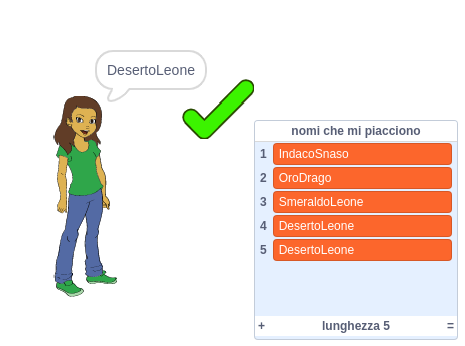

\--- no-print \---

Questa è la versione del progetto per **Scratch 3**. C'è anche una versione [Scratch 2 del progetto](https://projects.raspberrypi.org/en/projects/username-generator-scratch2).

\--- /no-print \---

## Introduzione

È importante non utilizzare il proprio nome o qualsiasi informazione personale nello username (nome utente) usato online. In questo progetto genererai username divertenti che puoi utilizzare su siti Web come Scratch.

### Che cosa creerai

\--- no-print \---

Per provare il progetto finito:

- Fai clic sullo sprite ragazza per generare un nuovo nome utente
- Fai clic su  ✔  per aggiungere uno username che ti piace alla lista

  <iframe allowtransparency="true" width="485" height="402" src="https://scratch.mit.edu/projects/embed/292974184/?autostart=false" frameborder="0" scrolling="no"></iframe>
  

\--- /no-print \---

\--- print-only \---

\--- /print-only \---

## \--- collapse \---

## title: Di cosa hai bisogno

### Hardware

- Un computer in grado di eseguire Scratch

### Software

- Scratch 3 (sia[online ](https://rpf.io/scratchon) sia[offline ](https://rpf.io/scratchoff){:target="_blank"})

### Download

Il progetto dal quale partire può essere trovato [qui](https://rpf.io/p/en/username-generator-go){:target="_blank"}.

\--- /collapse \---

## \--- collapse \---

## title: Cosa imparerai

- Usare le liste in Scratch
- Usare lo strumento di disegno per creare immagini
- Come esportare file di testo e immagini da Scratch

\--- /collapse \---

## \--- collapse \---

## title: Informazioni aggiuntive per gli educatori

\--- no-print \---

Se intendete stampare questo progetto, cliccate su [Versione stampabile](https://projects.raspberrypi.org/en/projects/username-generator/print){:target="_blank"}.

\--- /no-print \---

Puoi trovare [qui il progetto completo](https://rpf.io/p/en/username-generator-get){:target="_blank"}.

\--- /collapse \---