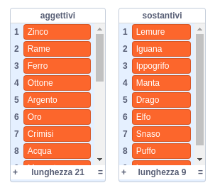

## Generare username

Esistono molti siti web e app che utilizzano uno username per identificarti. Questo username è spesso visibile agli altri. Gli username possono anche essere chiamati screen name, tag gamer o handle.

È importante che il tuo username non sia il tuo vero nome e che non includa alcuna informazione personale, come l'età, l'anno di nascita o il luogo in cui vivi. Altre persone vedranno il tuo username, quindi assicurati che sia educato e considera cosa la gente penserà di te quando verrà letto. Ricorda che potresti usare il tuo username per molto tempo: ti piacerà ancora tra tre anni?

Come puoi vedere, è importante scegliere con cura il tuo username. Creiamo un progetto Scratch per generare username "AggettivoSostantivo" come "DiamanteIguana".

--- task ---

Apri il progetto iniziale di Scratch.

**Online**: apri qui il progetto dal quale iniziare [rpf.io/usernameon](https://rpf.io/usernameon){:target="_blank"}.

Se hai un account su Scratch, puoi farne una copia cliccando su **Remix**.

**Offline**: apri [il progetto iniziale](https://rpf.io/p/it-IT/username-generator-go){:target="_blank"} nell'editor offline.

Se hai bisogno di scaricare ed installare la versione offline di Scratch, puoi trovarla qui [rpf.io/scratchoff](https://rpf.io/scratchoff){:target="_blank"}.

Dovresti trovare due elenchi sullo Stage - `aggettivi` e `sostantivi`:



--- /task ---

--- task ---

Fai clic su **Variabili** e quindi fare clic sulle caselle accanto alle liste `aggettivi` e `sostantivi` per deselezionarle e nasconderle.


--- /task ---

--- task ---

Aggiungi una variabile chiamata `username` che dovrebbe essere disponibile **per tutti gli sprite**.

[[[generic-scratch3-add-variable]]]

--- /task ---

--- task ---

Fai clic sulla casella accanto a `username` per deselezionarlo e non renderlo visibile sullo stage.


--- /task ---

--- task ---

Aggiungi uno sprite di persona: puoi scegliere il tuo preferito.


Puoi anche fare clic su **Costumi** e scegliere il costume che preferisci.

--- /task ---

--- task ---

Aggiungi questo codice allo sprite della tua persona:


```blocks3
when this sprite clicked
set [username v] to []
```

--- /task ---

--- task ---

Devi combinare un aggettivo e un sostantivo, quindi aggiungi un blocco `unisci`{:class="block3operators"} all'interno del tuo blocco `porta a`{:class="block3variables"}.


```blocks3
when this sprite clicked
set [username v] to (join [apple] [banana] :: +)
```

--- /task ---

--- task ---

Aggiungi un aggettivo nella prima casella nel blocco `unione`{:class="block3operators"}.


```blocks3
when this sprite clicked
set [username v] to (join (item (1) of [aggettivi v] :: +) [banana])
```

--- /task ---

--- task ---

Scegli un aggettivo `casuale`{:class="block3operators"} tra 1 e la `lunghezza della lista aggettivi`{:class="block3variables"}


```blocks3
when this sprite clicked
set [username v] to (join (item (pick random (1) to (length of [aggettivi v] :: +) :: +) of [aggettivi v]) [banana])
```

--- /task ---

--- task ---

Aggiungi un nome casuale nella seconda casella.


```blocks3
when this sprite clicked
set [username v] to (join (item (pick random (1) to (length of [aggettivi v])) of [aggettivi v]) (item (pick random (1) to (length of [nomi v] :: +) :: +) of [nomi v] :: +))
```

--- /task ---

--- task ---

Ora aggiungi blocchi di codice per far dire alla tua persona lo username.


```blocks3
when this sprite clicked
set [username v] to (join (item (pick random (1) to (length of [aggettivi v])) of [aggettivi v]) (item (pick random (1) to (length of [nomi v])) of [nomi v]))
+ say (username :: variables)
```

--- /task ---

--- task ---

Prova il tuo codice cliccando sullo sprite della persona. Dovresti ottenere un nuovo username casuale ogni volta.


--- /task ---